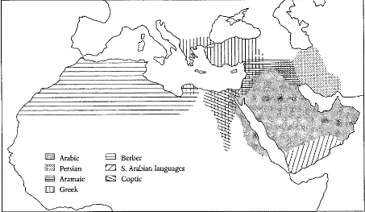

**Language:** North Levantine Arabic

# The Background of Arabic
## About Arabic
Arabic (more precisely, the group of Arabic dialects) is spoken by about 350 million people[^1] across Asia and Africa. It is the sole or joint official language in 20 independent states, and the native language of a significant fraction of the Israeli and Palestinian population.  

[^1]: [Ethnologue.](https://www.ethnologue.com/language/ara)

It is the liturgical language of Islam (in its classical form) and the language in which the holy book of Islam, the Qur'an, is written.  

In addition, it is one of the six official languages of the United Nations.[^2]

[^2]: Holes, Clive. *Modern Arabic: Structures, functions, and varieties.* Georgetown University Press, 2004. (page 1)

## The Semitic Language Family
The Arabic language belongs to the Semitic language family, which consists of languages spoken around the Middle East, the Arabian Peninsula and North Africa. The earliest attested texts of this family are from the ancient Near East, *i.e.*, Syria, Palestine and Mesopotamia[^3].  

[^3]: Holes, Clive. *Modern Arabic: Structures, functions, and varieties.* Georgetown University Press, 2004. (page 10)

The Semitic language family also includes languages like Akkadian, Aramaic, South Arabian and Ge'ez.

### Proto-Semitic
The Semitic language family is posited to have as a parent language the unattested Proto-Semitic language, analogous to the Indo-European languages.  
However, the reconstruction of Proto-Semitic has posed considerably more difficulties than in the case of PIE. This is because of the fundamentally different pattern that the development of Semitic languages have followed.  

The Indo-European family diverged rapidly and spread over a wide area. Thereafter, different languages were not in regular contact until a more than significant difference had emerged between them.  
In the case of the Semitic languages, however, the different languages continued to be spoken in contiguous areas, restricted to a relatively small region. Thus the continual borrowing and influence these languages have had on each other considerably increase the difficulty inherent in the reconstruction of a parent language.[^4]  

[^4]: Versteegh, Kees. *The Arabic language.* Columbia University Press, 1997. (page 10)

It has been suggested that the Semitic languages cannot be studied in the tree-based genealogical model that has been the convention in the case of Indo-European languages.

### Classification
For the reason described above, the genealogical classification of the Semitic languages has not been straightforward.  
Two main models of the development of the Semitic languages have been suggested. The first one consists of repeated waves of migration outward from some common place of origin (*Urheimat*), while the second one describes the process as a gradual infiltration from the peripheral areas of the region, influencing the dialects spoken in the inner areas.  

The current theory of development suggests that around 3000 BCE, a split occurred into the East Semitic languages and the rest, which split around 2000 BCE into the North-West and South-West groups. Typically, the former is considered to include Hebrew, Canaanite, Aramaic, Ugaritic and Eblaitic, while the latter includes South Arabian and Ge'ez (see Figure 1).[^5]  

[^5]: Versteegh, Kees. *The Arabic language.* Columbia University Press, 1997. (page 12)

However, Arabic's position in this genealogy is problematic. It is clear that it belongs in the western group, although it shares considerable similarities with both the North-West and the South-West subgroups.  

For this reason, sometimes Arabic is classified with Hebrew and Aramaic in the Central Semitic branch, rather than the South branch (see Figure 2).[^6]

[^6]: Versteegh, Kees. *The Arabic language.* Columbia University Press, 1997. (page 14)

Another possibility, put forward by Garbini (1984), is that the Semitic languages originated from in and around Syria, as an initially sedentary population, but smaller groups continually adopted nomadic livelihoods and broke off from the main group, while contact with external bedouin (nomadic) groups continued to occur. In this model, Arabic is the language of a group that broke off from the main tribe in the second half of the 2nd century BCE, and moved far enough south to have been considerably influenced by this group of languages.[^7]

### Features
While the internal classification of the Semitic language family continues to be fuzzy, we can clearly delineate some features common to all the languages posited to be in this group, like:

* **Triradicalism.** Most verbs and nouns in Semitic languages tend to be made up of three consonants, common to all words related in meaning, and vowels inserted in between as a form of inflection or derivation.
* **Emphatic consonants.** Some consonants have "emphatic" forms, pronounced differently. In Arabic, for instance, this emphasis is manifested as glottalisation.[^7]

[^7]: Versteegh, Kees. *The Arabic language.* Columbia University Press, 1997. (page 11)

## Forms of Arabic
Arabic is known across the world in different forms, and is described as a *macrolanguage* by Ethnologue[^1] for this reason. The various varieties (commonly referred to as "dialects") it encompasses are not entirely mutually intelligible.

### *Al-Fusha* vs. *Al-Ammiyah*
A distinction that has persisted for centuries is that between the so-called *al-fusha* and *al-ammiya* varieties of the language. *al-fusha*, roughly translated as "eloquent", refers to a more formal and widely understood form of the language, while *al-ammiya* is a term describing the low-formality, regional registers.[^8]  

[^8]: Holes, Clive. *Modern Arabic: Structures, functions, and varieties.* Georgetown University Press, 2004. (page 5)

Two important forms of *al-fusha* are Classical Arabic (CLA) and Modern Standard Arabic (MSA). Classical Arabic is part of the reason for the perception of the entire continuum as a single language – it is a unifying strand tying together Muslim Arabic speakers (90% of all Arabic speakers) from across the world. It is the language of the Qur'an and is considered an "immutable linguistic phenomenon"[^9], the beginning of the Arabic language itself.  

[^9]: Holes, Clive. *Modern Arabic: Structures, functions, and varieties.* Georgetown University Press, 2004. (page 4)

Modern Standard Arabic is the modern descendant of CLA, in use as a kind of lingua franca across the Arabic-speaking world. It is the medium of all writing, speaking and television-based media, and of formal discourse and education (in practice, instruction in schools is carried out in a mixture of MSA and the regional variety).[^10]

### Classification
There are two major dimensions along which the dialects of Arabic are divided: the nature of the major groups that speak them, and the regions in which they are spoken.  

Along the first, we distinguish dialects spoken by nomadic people (bedouins) from those spoken by sedentary populations. Historically, the bedouin dialects have been considered more conservative[^10] than the sedentary ones, subject to less influence and reflecting more exclusively an older, purer stage of Arabic; so much so that when the effort to codify Arabic began in the mid-8th century, scholars sometimes settled disputes by reference to the Arabic spoken by the bedouin tribes.  

[^10]: Holes, Clive, ed. *Arabic historical dialectology: Linguistic and sociolinguistic approaches.* Vol. 30. Oxford University Press, 2018. (page 6)

Regionally, the Arabic dialects are split into western (Maghrebi) and eastern (Mashreqi) dialects. The Maghrebi dialects principally include those of North Africa, while the Mashreqi dialects cover Egypt, Iraq, Syria, Palestine, and Lebanon (the last three coming under the Levant).[^11]

[^11]: Holes, Clive, ed. *Arabic historical dialectology: Linguistic and sociolinguistic approaches.* Vol. 30. Oxford University Press, 2018. (page 20)

## The Current Situation
The current linguistic situation presents a continuum varying across the dimensions of space and formality. Thus we have the regional dialects at the casual end, which are the populations in the various regions acquire as mother tongues, and Modern Standard Arabic as the high-formality register. Even MSA, however, has regional variations to some extent.  

There is thus a gradual narrowing of the gap between spoken Arabic and MSA. Moreover, there is considerable variation even with the individual regions, with the dialects spoken in and around capital cities (*e.g.* Cairo or Damascus) being treated as informal standards.[^12]

[^12]: Holes, Clive. *Modern Arabic: Structures, functions, and varieties.* Georgetown University Press, 2004. (pages 48-9)

## History
We will first give a rough overview of the history of the Arabic language, and then describe each stage in some more detail.  

### Overview
The history of the Arabic language can be roughly divided into two periods, demarcated by the Revelation of the Qur'an to Prophet Muhammad by the archangel Gabriel (in 610 CE), and the expansion of the Islamic Empire, marked by a series of conquests from 632 to 715 CE.  

Prior to these events, there were groups of Arabs in various places, including the Levant[^13]. The conquests, however, led to an influx of Arabic speakers from the Arabian peninsula, who spoke a different group of dialects.  

[^13]: Holes, Clive, ed. *Arabic historical dialectology: Linguistic and sociolinguistic approaches.* Vol. 30. Oxford University Press, 2018. (page 170)

It is popularly believed that the modern Arabic dialects are the result of corruption of Classical Arabic by the non-native speakers of the Islamic Empire. However, this does not present an accurate picture. Arabic was spoken in its pre-Classical form in many of the regions encompassed by the empire, alongside many regional languages, and dialectal variation has been a consistent feature of Arabic since the time of the Qur'an.[^14]

[^14]: Holes, Clive, ed. *Arabic historical dialectology: Linguistic and sociolinguistic approaches.* Vol. 30. Oxford University Press, 2018. (page 7)

### Detailed History
#### Pre-Islamic Arabic
The beginnings of Arabic as a Semitic language, as we have seen, are not very clear. However, we can describe in some detail the situation of Arabic at the time of the Islamic Revelation.  
The period prior to this event is referred to as the "time of ignorance", *i.e.*, ignorance of the divine will that became known through the Prophet.[^15]  

[^15]: Holes, Clive, ed. *Arabic historical dialectology: Linguistic and sociolinguistic approaches.* Vol. 30. Oxford University Press, 2018. (page 2)

The nomadic tribes who lived in the Arabian Peninsula prior to the Islamic Revelation had a thriving oral tradition, which was not written down till the mid-8th century CE. The poems, referred to as qasaa-id, show dialectal differences (evidencing the diversity in Arabic dialects from an early period), and are generally believed to be in a special register, distinct from that in use for everyday conversation. This poetic tradition is the only direct evidence we have for pre-Islamic Arabic. Although the regional differences are evident, the register is generally based on the dialects of central and eastern Arabia (the region known as Najd).  
The Qur'an as a source of information about the early stages of Arabic poses similar challenges. It, too, is not written in a conversational style, and shows some dialectal features from the west of the Arabian Peninsula (the Hejaz; modern Yemeni Arabic is a continuation of the Hejazi dialect).[^16]

[^16]: Holes, Clive. *Modern Arabic: Structures, functions, and varieties.* Georgetown University Press, 2004. (page 18)

#### In the Empire, Before the Empire 
The language situation prior to the conquests differed across what was to become the Empire.  

In Syria, Lebanon, Israel and Jordan (which were collectively referred to as assa:m), the Byzantine Empire was in power. However, the population spoke Aramaic, and they had some contact with the neighbouring bedouin Arabs, some of whom had also settled in the region.  

Similarly, in Iraq (the Mesopotamian region), Aramaic and Farsi were popularly spoken, as the areas was sandwiched between the Sasanian Empir of Persia and the Arab regions. There were some Arab settlers in this region as well.  

The circumstances in Egypt differed considerably, however. The boundaries between the ethnicities living in this area (the Christian Coptic-speaking population and the Arabs) were deeper, and Coptic was the liturgical and administrative language.  

North Africa, too, presented a different scene. The details of the period are not entirely clear, as it was thinly populated; however, we know that it was under the Byzantine Empire, although the Greeks exercised no power over the Berber tribes native to the region.[^17]

[^17]: Holes, Clive. *Modern Arabic: Structures, functions, and varieties.* Georgetown University Press, 2004. (pages 18-22)

### The Early Years of the Empire
There are multiple common strands we can identify in the spread of Arabic across the Empire in its infancy. Major among these are pre-conquest contact (the Arabic-speaking populations settled in and around the areas), the spread of Islam (which was less important initially but later came to play a role in education), and urbanisation and migration (leading to the assimilation of Arabs with the local natives).  

The third factor will be seen to be the most important. The first would be expected to have the most effect, but a counterexample is seen in North Africa, where Arabs were not present until the conquests. Similarly, the second factor has its counterexamples in regions where Islam took hold but Arabic did not, like Persia (where Farsi continues to be the major language) and northern Iraq (where the Kurds speak the indigenous Kurdish language). Both these languages are Indo-European.  

Despite these commonalities, the arabicisation of individual regions proceeded in various ways.  

In Syria, the Greeks emigrated *en masse* following the takeover, and no new cities were developed in the next few years. Arabic quickly displaced Aramaic in the cities, but bilingualism persisted in rural areas for a long time (in some regions, to date). Eventually, Arabic became the sole player in the field.  

In Egypt, the Islamic Empire tried to make use of the remnants of the Byzantine Empire's administrative framework. Thus, Coptic and Greek retained their hold until the 8th century. In fact, conversion to Islam was initially discouraged, as the non-Muslim population was the main source of revenue due to the *jizya* tax, levied on Jews and Christians. From the early 8th century, three factors contributed to the rise of Arabic in Egypt: Arabs immigrating in large numbers, the spread of Islam, and the disbanding of the army (many of whose soldiers settled in the region).  

In Iraq, like in Syria, the spread of Arabic happened gradually. Notably, however, there was no mass flight (although there was considerable immigration and some new cities were created). Furthermore, the adoption of Islam was a major factor.  

The arabicisation of North Africa was much slower, as it was thinly populated and Islam was slow to spread here. The Berber tribes of the region continued to speak their dialects until the mid-11th century, when groups of Arabs migrated from the east to Morocco.[^18]

[^18]: Holes, Clive. *Modern Arabic: Structures, functions, and varieties.* Georgetown University Press, 2004. (pages 30-36)

### Middle Arabic
The codification of Arabic started when the Umayyad dynasty gave way to the Abbasids in 750 CE. It began by extrapolation from the Qur'an and from pre-Islamic poetry, and essentially never changed for the next seven centuries.  

Under the name of *al-arabiyya*, Classical Arabic was thus canonised. Eventually, the loss of inflectional markings, known as *?iraab*, leaked into daily speech, and the use of these markings came to be seen as pedantic. This situation remained largely unchanged until the beginning of the 19th century.[^19]

[^19]: Holes, Clive. *Modern Arabic: Structures, functions, and varieties.* Georgetown University Press, 2004. (pages 36-40) 

## The Modern Era
The 19th century saw a renaissance of literary Arabic, primarily to due to the efforts of Christian clerics trying to understand the Qur'an (motivated by a desire to refute it).  

Another important development in this time period was Muhammad Ali's coup in Egypt, which ended the rule of the French. Muhammad Ali and his descendants began the movement to modernise Arabic, to render it a suitable vehicle for technological and scientific education. This was especially important as it was seen as a unifying symbol for the Arab world after World War 1. Arabic academies came up in Damascus and Cairo to study and standardise the language.[^20]

[^20]: Holes, Clive. *Modern Arabic: Structures, functions, and varieties.* Georgetown University Press, 2004. (pages 42-46)

# North Levantine Arabic
As we have seen, the modern form Arabic consists of its various dialects spoken across the Arab world. A major one among these is the Levantine group of dialects, spoken in the region typically known as the Levant: Syria, Palestine, Lebanon, Israel, Jordan, Turkey and Cyprus (sometimes referred to as the Near East). This dialect family is also known as the Syro-Lebanese group.[^21]  

[^21]: Holes, Clive, ed. *Arabic historical dialectology: Linguistic and sociolinguistic approaches.* Vol. 30. Oxford University Press, 2018. (page 170)

We have noted that the Arabic dialects have been exposed to foreign languages throughout their existence. One of the characteristics of the Levantine group is the influence that Aramaic has had on them, since they co-existed for more than a century in the initial period of the Islamic Empire.[^22]

[^22]: Holes, Clive, ed. *Arabic historical dialectology: Linguistic and sociolinguistic approaches.* Vol. 30. Oxford University Press, 2018. (page 19)

It is also worth noting that out of all the dialect groups Arabic consists of, the Levantine dialects bear the greatest resemblance to the Egyptian group. These two dialect families have remained in continuous contact over the centuries, and this long exposure has led to the large number of similarities.[^23]

[^23]: Holes, Clive, ed. *Arabic historical dialectology: Linguistic and sociolinguistic approaches.* Vol. 30. Oxford University Press, 2018. (page 175)

# References
The following works have been cited above:

1. Holes, Clive, ed. *Arabic historical dialectology: Linguistic and sociolinguistic approaches.* Vol. 30. Oxford University Press, 2018.
2. Holes, Clive. *Modern Arabic: Structures, functions, and varieties.* Georgetown University Press, 2004.
3. Versteegh, Kees. *The Arabic language.* Columbia University Press, 1997.
4. Ethnologue