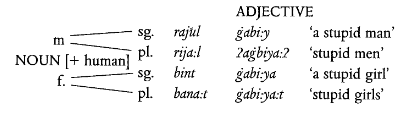

**Note on Transcription.** For ease of typesetting, the ArabTeX system of transcription has been followed. The mapping of Arabic symbols to ArabTeX can be found in the appendix.

**Links.** The presentation can be found at [**here**](https://docs.google.com/presentation/d/1qcMWDyYFlwl2YJM8OPDnVV8Ex2dMe6figZCmpyxrdew/edit?usp=sharing) and the audio recordings of the native speaker informant, along with the video presentation, [**here**](https://drive.google.com/drive/folders/1nY7vmXDp9og7lGJMw08H5cK0vrknp7og?usp=sharing).

# The Background of Arabic
## About Arabic
Arabic (more precisely, the group of Arabic dialects) is spoken by about 350 million people[^1] across Asia and Africa. It is the sole or joint official language in 20 independent states, and the native language of a significant fraction of the Israeli and Palestinian population.  

[^1]: [Ethnologue.](https://www.ethnologue.com/language/ara)

It is the liturgical language of Islam (in its classical form) and the language in which the holy book of Islam, the Qur'an, is written.  

In addition, it is one of the six official languages of the United Nations.[^2]

[^2]: Holes, Clive. *Modern Arabic: Structures, functions, and varieties.* Georgetown University Press, 2004. (page 1)

## The Semitic Language Family
The Arabic language belongs to the Semitic language family, which consists of languages spoken around the Middle East, the Arabian Peninsula and North Africa. The earliest attested texts of this family are from the ancient Near East, *i.e.*, Syria, Palestine and Mesopotamia[^3]. The Semitic language family also includes languages like Akkadian, Aramaic, South Arabian and Ge'ez.  

[^3]: Holes, Clive. *Modern Arabic: Structures, functions, and varieties.* Georgetown University Press, 2004. (page 10)

The Semitic language family is posited to have as a parent language the unattested Proto-Semitic language, analogous to the Indo-European languages. However, the reconstruction of Proto-Semitic has posed considerably more difficulties than in the case of PIE. This is because of the fundamentally different pattern that the development of Semitic languages has followed.  
The Indo-European family diverged rapidly and spread over a wide area. Thereafter, different languages were not in regular contact until a more than significant difference had emerged between them.  
In the case of the Semitic languages, however, the different languages continued to be spoken in contiguous areas, restricted to a relatively small region. Thus the continual borrowing and influence these languages have had on each other considerably increase the difficulty inherent in the reconstruction of a parent language.[^4]  

[^4]: Versteegh, Kees. *The Arabic language.* Columbia University Press, 1997. (page 10)

It has been suggested that the Semitic languages cannot be studied in the tree-based genealogical model that has been the convention in the case of Indo-European languages.

While the internal classification of the Semitic language family continues to be fuzzy, we can clearly delineate some features common to all the languages posited to be in this group, like:

* **Triradicalism.** Most verbs and nouns in Semitic languages tend to be made up of three consonants, common to all words related in meaning, and vowels inserted in between as a form of inflection or derivation.
* **Emphatic consonants.** Some consonants have "emphatic" forms, pronounced differently. In Arabic, for instance, this emphasis is manifested as glottalisation.[^7]

[^7]: Versteegh, Kees. *The Arabic language.* Columbia University Press, 1997. (page 11)

## Forms of Arabic
Arabic is known across the world in different forms, and is described as a *macrolanguage* by Ethnologue[^1] for this reason. The various varieties (commonly referred to as "dialects") it encompasses are not entirely mutually intelligible.

### *Al-Fusha* vs. *Al-Ammiyah*
A distinction that has persisted for centuries is that between the so-called `'Alfu.s.hA` and ``'Al`AmmIya`` varieties of the language. `'Alfu.s.hA`, roughly translated as "eloquent", refers to a more formal and widely understood form of the language, while ``'Al`AmmIya`` is a term describing the low-formality, regional registers.[^8]  

[^8]: Holes, Clive. *Modern Arabic: Structures, functions, and varieties.* Georgetown University Press, 2004. (page 5)

Two important forms of `'Alfu.s.hA` are Classical Arabic (CLA) and Modern Standard Arabic (MSA). Classical Arabic is part of the reason for the perception of the entire continuum as a single language – it is a unifying strand tying together Muslim Arabic speakers (90% of all Arabic speakers) from across the world. It is the language of the Qur'an and is considered an "immutable linguistic phenomenon"[^9], the beginning of the Arabic language itself.  

[^9]: Holes, Clive. *Modern Arabic: Structures, functions, and varieties.* Georgetown University Press, 2004. (page 4)

Modern Standard Arabic is the modern descendant of CLA, in use as a kind of lingua franca across the Arabic-speaking world. It is the medium of all writing, speaking and television-based media, and of formal discourse and education (in practice, instruction in schools is carried out in a mixture of MSA and the regional variety).[^10]

### Classification
There are two major dimensions along which the dialects of Arabic are divided: the nature of the major groups that speak them, and the regions in which they are spoken.  

Along the first, we distinguish dialects spoken by nomadic people (bedouins) from those spoken by sedentary populations. Historically, the bedouin dialects have been considered more conservative[^10] than the sedentary ones, subject to less influence and reflecting more exclusively an older, purer stage of Arabic; so much so that when the effort to codify Arabic began in the mid-8th century, scholars sometimes settled disputes by reference to the Arabic spoken by the bedouin tribes.  

[^10]: Holes, Clive, ed. *Arabic historical dialectology: Linguistic and sociolinguistic approaches.* Vol. 30. Oxford University Press, 2018. (page 6)

Regionally, the Arabic dialects are split into western (Maghrebi) and eastern (Mashreqi) dialects. The Maghrebi dialects principally include those of North Africa, while the Mashreqi dialects cover Egypt, Iraq, Syria, Palestine, and Lebanon (the last three coming under the Levant).[^11]

[^11]: Holes, Clive, ed. *Arabic historical dialectology: Linguistic and sociolinguistic approaches.* Vol. 30. Oxford University Press, 2018. (page 20)

## The Current Situation
The current linguistic situation presents a continuum varying across the dimensions of space and formality. Thus we have the regional dialects at the casual end, which are the populations in the various regions acquire as mother tongues, and Modern Standard Arabic as the high-formality register. Even MSA, however, has regional variations to some extent.  

There is thus a gradual narrowing of the gap between spoken Arabic and MSA. Moreover, there is considerable variation even with the individual regions, with the dialects spoken in and around capital cities (*e.g.* Cairo or Damascus) being treated as informal standards.[^12]

[^12]: Holes, Clive. *Modern Arabic: Structures, functions, and varieties.* Georgetown University Press, 2004. (pages 48-9)

## History
We will first give a rough overview of the history of the Arabic language, and then describe each stage in some more detail from the perspective of the Levant.  

### Overview
The history of the Arabic language can be roughly divided into two periods, demarcated by the Revelation of the Qur'an to Prophet Muhammad by the archangel Gabriel (in 610 CE), and the expansion of the Islamic Empire, marked by a series of conquests from 632 to 715 CE.  
The conquests, led to an influx of Arabic speakers from the Arabian peninsula to the colonies (joining the Arabic speakers already present there[^13]), who spoke a different group of dialects.  

[^13]: Holes, Clive, ed. *Arabic historical dialectology: Linguistic and sociolinguistic approaches.* Vol. 30. Oxford University Press, 2018. (page 170)

### Detailed History
#### Pre-Islamic Arabic
The beginnings of Arabic as a Semitic language, as we have seen, are not very clear. However, we can describe in some detail the situation of Arabic at the time of the Islamic Revelation.  

The nomadic tribes who lived in the Arabian Peninsula prior to the Islamic Revelation had a thriving oral tradition, which was not written down till the mid-8th century CE. The poems, referred to as qasaa-id, show dialectal differences (evidencing the diversity in Arabic dialects from an early period), and are generally believed to be in a special register, distinct from that in use for everyday conversation. This poetic tradition is the only direct evidence we have for pre-Islamic Arabic.  
The Qur'an as a source of information about the early stages of Arabic poses similar challenges. It, too, is not written in a conversational style.[^16]

[^16]: Holes, Clive. *Modern Arabic: Structures, functions, and varieties.* Georgetown University Press, 2004. (page 18)

#### In the Empire, Before the Empire 
The language situation prior to the conquests differed across what was to become the Empire.  

In Syria, Lebanon, Israel and Jordan (which were collectively referred to as `a^s^sAm`), the Byzantine Empire was in power. However, the population spoke Aramaic, and they had some contact with the neighbouring bedouin Arabs, some of whom had also settled in the region.  

The circumstances in Egypt differed considerably, however. The boundaries between the ethnicities living in this area (the Christian Coptic-speaking population and the Arabs) were deeper, and Coptic was the liturgical and administrative language.[^17]  

[^17]: Holes, Clive. *Modern Arabic: Structures, functions, and varieties.* Georgetown University Press, 2004. (pages 18-22)

### The Early Years of the Empire
There are multiple common strands we can identify in the spread of Arabic across the Empire in its infancy. Major among these are pre-conquest contact (the Arabic-speaking populations settled in and around the areas), the spread of Islam (which was less important initially but later came to play a role in education), and urbanisation and migration (leading to the assimilation of Arabs with the local natives).  

The third factor will be seen to be the most important. The first would be expected to have the most effect, but a counterexample is seen in North Africa, where Arabs were not present until the conquests. Similarly, the second factor has its counterexamples in regions where Islam took hold but Arabic did not, like Persia (where Farsi continues to be the major language) and northern Iraq (where the Kurds speak the indigenous Kurdish language). Both these languages are Indo-European.  

In Syria, the Greeks emigrated *en masse* following the takeover, and no new cities were developed in the next few years. Arabic quickly displaced Aramaic in the cities, but bilingualism persisted in rural areas for a long time (in some regions, to date). Eventually, Arabic became the sole player in the field.  

In Egypt, the Islamic Empire tried to make use of the remnants of the Byzantine Empire's administrative framework. Thus, Coptic and Greek retained their hold until the 8th century. In fact, conversion to Islam was initially discouraged, as the non-Muslim population was the main source of revenue due to the *jizya* tax, levied on Jews and Christians. From the early 8th century, three factors contributed to the rise of Arabic in Egypt: Arabs immigrating in large numbers, the spread of Islam, and the disbanding of the army (many of whose soldiers settled in the region).[^18]  

[^18]: Holes, Clive. *Modern Arabic: Structures, functions, and varieties.* Georgetown University Press, 2004. (pages 30-36)

### Middle Arabic
The codification of Arabic started when the Umayyad dynasty gave way to the Abbasids in 750 CE. It began by extrapolation from the Qur'an and from pre-Islamic poetry, and essentially never changed for the next seven centuries.  

Under the name of ``'Al`arabIyaT``, Classical Arabic was thus canonised. Eventually, the loss of inflectional markings, known as `'irAb`, leaked into daily speech, and the use of these markings came to be seen as pedantic. This situation remained largely unchanged until the beginning of the 19th century.[^19]

[^19]: Holes, Clive. *Modern Arabic: Structures, functions, and varieties.* Georgetown University Press, 2004. (pages 36-40) 

## The Modern Era
The 19th century saw a renaissance of literary Arabic, primarily to due to the efforts of Christian clerics trying to understand the Qur'an (motivated by a desire to refute it).  

Another important development in this time period was Muhammad Ali's coup in Egypt, which ended the rule of the French. Muhammad Ali and his descendants began the movement to modernise Arabic, to render it a suitable vehicle for technological and scientific education. This was especially important as it was seen as a unifying symbol for the Arab world after World War 1. Arabic academies came up in Damascus and Cairo to study and standardise the language.[^20]

[^20]: Holes, Clive. *Modern Arabic: Structures, functions, and varieties.* Georgetown University Press, 2004. (pages 42-46)

## Levantine Arabic
As we have seen, the modern form Arabic consists of its various dialects spoken across the Arab world. A major one among these is the Levantine group of dialects, spoken in the region typically known as the Levant: Syria, Palestine, Lebanon, Israel, Jordan, Turkey and Cyprus (sometimes referred to as the Near East). This dialect family is also known as the Syro-Lebanese group.[^21]  

[^21]: Holes, Clive, ed. *Arabic historical dialectology: Linguistic and sociolinguistic approaches.* Vol. 30. Oxford University Press, 2018. (page 170)

We have noted that the Arabic dialects have been exposed to foreign languages throughout their existence. One of the characteristics of the Levantine group is the influence that Aramaic has had on them, since they co-existed for more than a century in the initial period of the Islamic Empire.[^22]

[^22]: Holes, Clive, ed. *Arabic historical dialectology: Linguistic and sociolinguistic approaches.* Vol. 30. Oxford University Press, 2018. (page 19)

It is also worth noting that out of all the dialect groups Arabic consists of, the Levantine dialects bear the greatest resemblance to the Egyptian group. These two dialect families have remained in continuous contact over the centuries, and this long exposure has led to the large number of similarities.[^23]

[^23]: Holes, Clive, ed. *Arabic historical dialectology: Linguistic and sociolinguistic approaches.* Vol. 30. Oxford University Press, 2018. (page 175)

# Arabic Phonology
## The Study of Phonology
As we have seen, varieties of Arabic have historically been classified into `'Alfu.s.hA` and ``'Al`AmmIya``, the formal (or "pure") and colloquial types.  
The most common `'Alfu.s.hA` variety of today, Modern Standard Arabic, is of course not the native language of any section of the population. It therefore derives its notions of correctness in pronunciation from its predecessor, Classical Arabic, which has not been spoken for centuries. Thus for this we rely on descriptions by early Arab grammarians and philologists.  

This is problematic because, while the early studies of Arabic phonology were extremely detailed as far as phonemes are concerned, fall short in non-phonemic matters, like stress and intonation.[^24]  

[^24]: Holes, Clive. *Modern Arabic: Structures, functions, and varieties.* Georgetown University Press, 2004. (pages 56-7)

The first scholar to systematically study Arabic phonology was Al-Khalil, in his work ``kitAb 'Al`Ayn``. This was carried on by his disciple Sibawayhi, in his monumental work `'AlkitAb`. Some contributions (in particular, the details of the vowel system) were later made in Ibn Jinni's `'Al_hasA'is`.[^25]

[^25]: Benmamoun, Elabbas, and Reem Bassiouney, eds. *The Routledge handbook of Arabic linguistics.* Routledge, 2018 (page 11); Owens, Jonathan. *The Oxford handbook of Arabic linguistics.* Oxford University Press, 2013. (page 38)

## The Inventory
Modern Standard Arabic has a relatively rich consonant inventory, consisting of 28 sounds, and a restricted vowel inventory with 3 phonemes.[^26]

[^26]: Holes, Clive. *Modern Arabic: Structures, functions, and varieties.* Georgetown University Press, 2004 (page 57); Owens, Jonathan. *The Oxford handbook of Arabic linguistics.* Oxford University Press, 2013. (page 39)

Variation across dialectal phonology has persisted from the early Islamic period, evidenced by Sibawayhi's descriptions. In his `kitAb`, he lists six "good" (`musta.hsAna`) and seven "bad" (`.gayr musta.hsAna`) variations.[^27]

[^27]: Owens, Jonathan. *The Oxford handbook of Arabic linguistics.* Oxford University Press, 2013. (pages 38, 45)

### Consonants
We have noted above that there are 28 consonant phonemes in MSA. These can be seen in Figure 1 (the phonemes in brackets are dialectal variations).  

A distinctive feature of Arabic is the high percentage (8 out of 28) of "guttural" (velar and postvelar) consonants in its inventory. In addition to plain velar and postvelar consonants, there are "emphatic" variants of four front consonants (a common feature across Semitic languages), which in Arabic are realised as "pharyngealised" consonants. These sounds are characterised by three processes in articulation:

* the retraction of the tongue tip
* the raising of the back part of the tongue towards the velum
* the constriction of the pharynx caused by (2).[^28]

[^28]: Holes, Clive. *Modern Arabic: Structures, functions, and varieties.* Georgetown University Press, 2004 (page 57)

These emphatic consonants are described as *mutbaq* ("covered" or "enclosed"), as opposed to *munfatih* ("open").[^29]  

[^29]: Owens, Jonathan. *The Oxford handbook of Arabic linguistics.* Oxford University Press, 2013. (page 55)

The consonants were called `'usUl` or "primary" by Al-Khalil, and were classified by him into "plain" (`si.hA.h`) and "hollow" (`'a^gwaf`). The plain consonant phonemes were further grouped into articulatory areas (Figure 2).[^30]

[^30]: Owens, Jonathan. *The Oxford handbook of Arabic linguistics.* Oxford University Press, 2013. (page 38)

These consonants form the inventory of both MSA and CLA, with the following three points of difference:

* `.d`, which in MSA is an emphatic voiced dental stop, but which Sibawayhi describes as having no non-emphatic counterpart;
* `.t`, which in MSA is an emphatic unvoiced dental stop, but which Sibawayhi describes as the emphatic version of /d/;
* `q`, which in MSA is an unvoiced uvular stop, but which Sibawayhi describes as voiced.[^31]

[^31]: Benmamoun, Elabbas, and Reem Bassiouney, eds. *The Routledge handbook of Arabic linguistics.* Routledge, 2018 (pages 12-3)

### Vowels
Arabic's vowel system is considerably reduced, consisting of only three phonemes: /i/, /u/ and /a/.  
In addition, there is a length-based distinction, *i.e.*, /i:/, /u:/ and /a:/ are distinct from the above three.[^32]

[^32]: Owens, Jonathan. *The Oxford handbook of Arabic linguistics.* Oxford University Press, 2013. (page 38)

The qualities of the three vowels are:

* /i/ is a close front vowel, pronounced with lips spread
* /u/ is a close back vowel, pronounced with lips rounded
* /a/ is an open vowel.

However, their realisation often depends on the dialect and the context.[^33]

[^33]: Holes, Clive. *Modern Arabic: Structures, functions, and varieties.* Georgetown University Press, 2004 (page 60)

## Syllable Structure
There are mainly six types of syllables: `Cv`, `Cv:`, `CvC`, `Cv:C`, `CvCC` and `Cv:CC`. Note that the onset can only consist of a single consonant.[^34]

[^34]: Holes, Clive. *Modern Arabic: Structures, functions, and varieties.* Georgetown University Press, 2004 (page 61)

## Processes
There are a number of phonological processes (synchronic) that occur; some are restricted to a limited number of dialects, while the others are present across all.  

One example of a process not present in all dialects is affrication, which is a feature of Gulf Arabic. In the presence of front vowels, velar stops (/g/ and /k/) change into the corresponding alveolar affricates (/dz/ and /ts/).[^35]

[^35]: Benmamoun, Elabbas, and Reem Bassiouney, eds. *The Routledge handbook of Arabic linguistics.* Routledge, 2018 (page 22)

Another example of a (more widespread) phonological process is pharyngealisation. As we have seen above, some consonants have emphatic or pharyngealised versions; these sounds cause their surroundings to be pronounced with a more retracted tongue root. This process occurs in Levantine, Gulf and Yemeni Arabic.  
However, there are differences in the way the `[+RTR]` feature spreads. For example, the number of segments, the direction of spreading and the segments which can block the spreading are some conditions which vary across dialects.[^36]

[^36]: Benmamoun, Elabbas, and Reem Bassiouney, eds. *The Routledge handbook of Arabic linguistics.* Routledge, 2018 (page 24)

An important process that occurs across all dialects of Arabic is the assimilation of the definite article /l-/. When the noun starts with a coronal consonant, the /l/ of the definite article assimilates to this. Examples of this include *n-noor* ("the light"), *sh-shams* ("the sun"), etc.  
However, an exception to this is the affricate /dz/. It is hypothesised that this is because /dz/ is the reflex of Proto-Semitic /g/, which is not a coronal phoneme.[^37]

[^37]: Benmamoun, Elabbas, and Reem Bassiouney, eds. *The Routledge handbook of Arabic linguistics.* Routledge, 2018 (page 25)

## Levantine Arabic
There are numerous features distinguishing Levantine phonology from that of MSA. We will consider three well-known ones: the reflexes of the interdental fricatives (`_t`, `_d` and `.z`), the voiced alveolo-palatal affricate `^g`, and the voiceless uvular stop `q`.

### Interdental Fricatives
This is a feature shared by the Levantine (except Jordanian), Hejazi, Egyptian and Maghrebi dialects of Arabic. The three interdental fricatives (voiceless and voiced plain, and voiced pharyngealised) are pronounced as the corresponding dental stops. This, in fact, is perceived as a characteristic of sedentary dialects across the Arab world, and is not shared by the bedouin varietes, even in the Levant.  

It is possible that this sound change is due to the Aramaic substrate present in this region, although this is not considered likely by some.[^38]  

[^38]: Holes, Clive, ed. *Arabic historical dialectology: Linguistic and sociolinguistic approaches.* Vol. 30. Oxford University Press, 2018. (page 876)

Notably, Levantine and Egyptian Arabic replace these sounds with the corresponding alveolar fricatives, in *borrowings* from MSA.[^39]  

[^39]: Benmamoun, Elabbas, and Reem Bassiouney, eds. *The Routledge handbook of Arabic linguistics.* Routledge, 2018 (page 14)

An interesting sociological distinction among the three pronunciations surfaces when we consider the relative prestiges of the three sets of pronunciations:  
The bedouin dialects preserve the interdental fricatives of MSA, and this pronunciation is popularly accepted as the most "correct" one.  
The native urban pronunciation popular in the Levant is the dental stops listed above, which are perceived as the most informal.  
The interdental fricatives used by urban speakers in loans and neologisms lie somewhere in between.  

Nevertheless, recently settled bedouins often switch from the interdentals to the alveolars in conversation with urban speakers. Moreover, which pronunciation is to be used is often decided by the semantic and pragmatic content of the word, where some words are associated with a certain pronunciation and would not be changed regardless of the formality.[^40]

[^40]: Holes, Clive. *Modern Arabic: Structures, functions, and varieties.* Georgetown University Press, 2004. (page 72-3)

### Alveolar Affricate
The alveolar affricate `^g` also has a number of reflexes across the Arab world.

In the Levant, a distinction is drawn between the dialects of rural and bedouin-origin populations, and other varieties (including Levantine MSA). The former pronounces this phoneme with its reflex in "common" MSA (the affricate), while the latter as a fricate /z/.[^41]

[^41]: Holes, Clive. *Modern Arabic: Structures, functions, and varieties.* Georgetown University Press, 2004 (page 75); Benmamoun, Elabbas, and Reem Bassiouney, eds. *The Routledge handbook of Arabic linguistics.* Routledge, 2018. (page 15)

### Uvular Stop
The voiceless uvular stop `q` is another phoneme which varies widely across dialects of Arabic. In the Levant itself, there are four distinct ways it is realised.  

In urban varieties, it usually surfaces as either /q/ itself, or the glottal stop. In rural and bedouin dialects, /q/ and /g/ are preferred pronunciations.  
In Palestine's rural regions, however, its reflexes also include /k/ and /ts/. Jordanian dialects also realise it as /g/.[^42]  

[^42]: Holes, Clive. *Modern Arabic: Structures, functions, and varieties.* Georgetown University Press, 2004 (page 73); Benmamoun, Elabbas, and Reem Bassiouney, eds. *The Routledge handbook of Arabic linguistics.* Routledge, 2018. (page 15)

Here, too, we can note some sociolinguistic phenomena. It has been claimed that the /g/ realisation of this phoneme has become associated with "masculinity", and the glottal realisation with "femininity", causing men of all backgrounds to adopt the former and women of all backgrounds to adopt the latter.  
In addition, the /k/ and /ts/ pronunciations have, it appears, become stigmatised as "rural" and are fading in the speech of younger speakers.[^43]

[^43]: Holes, Clive. *Modern Arabic: Structures, functions, and varieties.* Georgetown University Press, 2004 (page 73)

# Morphology
## Overview
The general principle of Arabic morphology is in line with that of the rest of the Semitic languages. This holds for all forms of Arabic – Classical, Modern Standard, and the dialects.  

The morphology is *nonconcatenative* – it does not rest on discontinuous segments (roots and affixes), but rather on a root-and-pattern system. Here, a word is made up of a root, which consists of (usually) three consonants, and a pattern, which inserts other sounds between the consonants of the root (called radicals).  

For example, `KTB` is a root meaning "write". Applying various patterns on it gives us words like `kitAb` (book), `maktab` (desk), `'iktitAb` (subscription).  
There are some constraints on the co-occurrence of radicals in roots (for example, the first two consonants cannot be homorganic).  

There are two types of patterns that are layered on the root to create actual words. First, derivational modifications are carried out (morphosemantic patterns), followed by inflections (morphosyntactic patterns).  

It is important to note that roots are *semantic abstractions*, *i.e.*, they are not functional words but only "hints" to the meaning of the words they form. The application of morphosemantic patterns yields what are known as *augmented roots*, which are also semantic abstractions; morphosyntactic patterns finally create actual words.[^44]

[^44]: Holes, Clive. *Modern Arabic: Structures, functions, and varieties.* Georgetown University Press, 2004. (page 99)

## Verb
## Morphosemantic Patterns
There are ten morphosemantic patterns that can be applied to a root to generate different forms of verbs. A rough overview of their forms and functions follows (we will denote the consonants of the root as `X`, `Y`, `Z` respectively).  
However, a single verb will usually not show more than eight different patterns.

* Pattern I (`XYZ`): This is the basis of derivational morphology and the most common pattern. It usually forms words by inserting short vowels `XaYaZ` (actions performed by agents, transitive or intransitive), `XaYiZ` (actions performed on oneself, *agent moyen*) or `XaYuZ` (acquisition of permanent qualities).
* Pattern II (`XYYZ`): This pattern has three main uses – it may intensify the meaning of Pattern I, indicate that the action was performed by another agent, or denote ascription of a quality to another entity.
* Pattern III (`Xv:YZ`): This pattern denotes an effort to achieve the meaning of Pattern I.
* Pattern IV (`?XYZ`): This pattern generally has a causative or factitive sense. It may overlap with Pattern III.
* Pattern V (`tXYZ`): This pattern denotes a reflexive action, or the effect of an action. It is common for verbs to have Pattern I (stative), Pattern II (causative) and Pattern V (reflexive) forms.
* Pattern VI (`tXv:YZ`): This pattern usually expresses a reciprocal action.
* Pattern VII (`nXYZ`): This pattern denotes the passive of Pattern I. It may have a similar sense to Pattern V.
* Pattern VIII (`XtYZ`): This pattern also has a reflexive sense, like Pattern V.
* Pattern IX (`XYZZ`): This pattern applies to a closed class of inchoative verbs. These verbs refer only to colours and physical defects.
* Pattern X (`stXYZ`): This pattern indicates the reflexive of Pattern IV.

There exist a small number of quadriliteral roots as well (roots with four consonants). Some of these are derived by fairly regular processes from triliteral roots, while the others are derived from foreign borrowings.[^45]

[^45]: Holes, Clive. *Modern Arabic: Structures, functions, and varieties.* Georgetown University Press, 2004. (page 100)

### Morphosyntactic Patterns
The augmented stem (after the application of a morphosemantic pattern) can generate two different stems for the finite verb, depending roughly on the aspect (the state of completion of the verb).  

One stem, which inflects further with both prefixes and suffixes, is called the imperfect stem or the p-stem. The other main stem that can be formed inflects with only suffixes, and is called the perfect stem or the s-stem.  

Each of these two stems has its own set of patterns for active and passive, and for each combination of person (first, second or third), number (singular, dual or plural), and gender (masculine or feminine).

Figure 1 shows the formation of the active and passive roots for both the p- and s-stems. Figure 2 shows the inflection of these roots according to person, number and gender.[^46]

[^46]: Holes, Clive. *Modern Arabic: Structures, functions, and varieties.* Georgetown University Press, 2004. (page 106)

### Levantine Arabic
There are two main types of changes that occurred in the eastern dialects of Arabic (including the urban centres of the Levant, as well as Cairo) – the loss of syntactic categories and modifications to the morphosemantic system.  

Of the first type, we note that in the 2nd and third person plural, the gender distinction is lost; the masculine form is generalised to both. The dual number is also lost, and superseded by the plural.  
Furthermore, the passive is consistently formed by a prefix (`'it-`), reminiscent of Patterns V and VI in MSA.  

Of the second type, we note that the vowels used in forming words of Pattern I are always the same for a certain stem (`a-a`, `i-i` or `u-u`).  
The initial `t-` of Patterns V and VI has in fact become identical to the `'it-` prefix. Similarly, Patterns II and IV (causatives and factitives) have partially coalesced together.[^47]

[^47]: Holes, Clive. *Modern Arabic: Structures, functions, and varieties.* Georgetown University Press, 2004. (page 119)

## Noun
There are mainly two types of nouns in Arabic – "primitive" nouns, which are not derived from any verbal root, and derivatives of verbs.  

Primitive nouns cannot function as adjectives, and are mostly masculine (some are feminine). Derived nouns, on the other hand, can sometimes function as adjectives (specifically, those denoting states, comparatives, diminutives and relational adjectives).
Derived nouns are of nine types – instance nouns, nouns of manner, nouns of place and time, nouns of instrument, nouns of profession/occupation, nouns of states, comparatives, diminutives and abstract nouns.[^48]

[^48]: Holes, Clive. *Modern Arabic: Structures, functions, and varieties.* Georgetown University Press, 2004. (page 155)

### Number
In MSA (and CLA), nouns distinguish three numbers: singular, dual and plural (for more than two objects). Collective nouns form a separate category and have their own patterns.  

Plurals are formed in two ways – suffixation and interdigitation of vowels.  
The nouns of profession or occupation, relational adjectives, comparatives, and a few primitive nouns form their plurals with suffixes – specifically, `-Una` (nominative) and `-Ina` (accusative and genitive) for masculine, and `-Atun` (nominative) and `-Itun` (accusative and genitive) for feminine.  

Plurals formed by interdigitation are often named *broken plurals*. These are unpredictable for primitive nouns, but fixed for derivatives; each pattern has a corresponding plural pattern.  

Notably, a single noun may have more than one plural. In such cases, it is possible for each plural to have a different sense.  

In the dialects (including Levantine), the rules for forming plurals are largely the same. The dual number is lost.  
There are also fewer broken plurals in the dialects.[^49]

[^49]: Holes, Clive. *Modern Arabic: Structures, functions, and varieties.* Georgetown University Press, 2004. (page 162)

### Case and Definiteness
Arabic has a three-case system, distinguishing nominative, accusative and genitive.  

There are two kinds of nouns – *triptotes* and *diptotes*. Triptotes distinguish definite from indefinite nouns in all three cases; indefiniteness is marked with a terminal *-n* (a process called *nunation* after the name of the letter representing /n/, *nun*).  

Interestingly, the `-N` also functions as an adverbial marker. Many of these words have been loaned into Hindi-Urdu and are in common use; *e.g.*, `masalana` (from `ma_talaN`, "for example"), `fOrana` (from `fawraN`, "immediately"), and `qarIbana` (from `qarIbaN`, "nearly").  

Diptotic nouns, on the other hand, collapse the accusative and genitive cases, and do not mark indefiniteness.  

In the dialects, however, case has disappeared from casual speech (a manifestation of the deletion of final short vowels, which is a consistent phonological rule operating between MSA and the dialects).[^50]

[^50]: Holes, Clive. *Modern Arabic: Structures, functions, and varieties.* Georgetown University Press, 2004. (page 172)

# Syntax
## Overview
Modern Standard Arabic, and, to a lesser extent, the Arabic dialects, tend to the synthetic side of the typological spectrum. Thus, features marked by syntax in English come under the domain of morphology in Arabic (for example, causatives, passives, etc.). Thus, the syntax is not as rich as the morphology.  

We will first have a broad description of sentence structure (including word order), and then a finer look at the internal structures of constituents (noun and verb phrases).

## Sentence Structure
Word order in Arabic has canonically been considered free by grammarians, due to the rich verbal morphology and the declension system in place for nouns. However, in practice, it is considerably more rigid, nearly determined by a number of syntactic, semantic and discourse factors.[^51] We will consider a small number of these here.  

[^51]: Holes, Clive. *Modern Arabic: Structures, functions, and varieties.* Georgetown University Press, 2004. (page 250)

A sentence in Arabic can be analysed as consisting of a subject and a predicate. The predicate may or may not contain a *finite* verb (it may have only a noun, or some form of participle); if there is no finite verb, the subject must be *freestanding* (it cannot be expressed as an enclitic suffix on the verb).  

The most frequent word order is VSO, followed by SVO. However, the length of a constituent (the number of words it includes, sometimes also called its *heaviness*) also plays a factor in its positioning – it is preferred to place heavier constituents towards the end.[^52]  

[^52]: Holes, Clive. *Modern Arabic: Structures, functions, and varieties.* Georgetown University Press, 2004. (page 251)

The definiteness of the subject is the first factor in determining the word order in the dialects; an indefinite subject comes after the verb (VSO). If the subject is definite, if the verb does not refer to an event (as opposed to a state) *and* the object is freestanding, then the word order is SVO.[^53]  

[^53]: Holes, Clive. *Modern Arabic: Structures, functions, and varieties.* Georgetown University Press, 2004. (page 259)

In the matter of *agreement* between the subject and the verb, there is a divergence between MSA and the dialects.  
In MSA, the verb always agrees with the subject in gender, but not in number *if it occurs before the subject*. Contrast this with the dialects (including Levantine), in which both gender and number always agree.[^54]

[^54]: Holes, Clive. *Modern Arabic: Structures, functions, and varieties.* Georgetown University Press, 2004. (page 262)

## Phrase Structure
We will look at the structures of noun phrases and verb phrases here.

### Noun Phrases
Broadly, an Arabic noun phrase can be one of three types – a simple noun, a noun-adjective pair, and a *construct phrase*.

#### Noun-Adjective Pairs
A noun-adjective phrase is composed of a noun and an attributive adjective. The two elements agree in gender, number, case and definiteness (see below).  

Definiteness is straightforward; the adjective needs to be made definite by prefixing `('A)l-`*. Case, too, inflects in a relatively simple manner.  

Gender and number, however, interact in more intricate ways. In the case of human nouns and nonhuman singular nouns, the gender and number both agree; in the case of nonhuman plural nouns, the adjective is invariably in its feminine singular form.[^55]

[^55]: Holes, Clive. *Modern Arabic: Structures, functions, and varieties.* Georgetown University Press, 2004. (page 202)

Definiteness is a characteristic of nouns and noun phrases. In general, a noun is definite if it is preceded by the definite article `('A)l-`*, it is followed by a pronominal suffix, it is the first element in a construct phrase (see below), *or* it is a proper noun.[^56]

[^56]: Holes, Clive. *Modern Arabic: Structures, functions, and varieties.* Georgetown University Press, 2004. (page 196)

#### Construct Phrases
Construct phrases (formed by a process called `'i.dAfaT`, or *annexation*) consist of two nouns, the second (the "amplifying" noun) modifying the first (the "annexing" noun) in some way. In such phrases, the annexing noun must be indefinite, and the amplifying noun must be in the genitive case.  

Attributive adjectives modifying construct phrases occur after *both* the elements (even though, semantically, they may only modify the annexing noun).  

Semantically, these phrases can have a wide variety of meanings. The relation between the nouns may be one of identity (*the city of Damascus*), quantity (*a cup of coffee*), agency (*the arrival of the king*), and so on.[^57]  

[^57]: Holes, Clive. *Modern Arabic: Structures, functions, and varieties.* Georgetown University Press, 2004. (page 205) 

In the dialects, construct phrases are often formed not by simple juxtaposition and inflection (as in MSA), but by the insertion of a particle between the constituent nouns. This process may, however, be restricted to a subset of the senses inherent in general `'i.dAfaT`.  
For example, in Amman, Jordan, the particle `tabA'` carries the meaning of possession.[^58]

[^58]: Holes, Clive. *Modern Arabic: Structures, functions, and varieties.* Georgetown University Press, 2004. (page 208)

#### Numbers in Noun Phrases
The agreement in numbers is significantly different between MSA and the dialects, and thus deserves a mention.  

MSA requires the number modifying the noun to agree with it in gender and number. All numbers except multiples of 10 (starting from 20) have distinct masculine and feminine forms.  

In the dialects, however, the numbers from 3 to 10, despite preserving both forms, utilise them to create a *semantic* distinction. The feminine forms are used for counting and for naming the numerals, while the masculine forms are used for actual enumeration.  
The numbers from 11 to 19 also have two forms corresponding to this distinction. However, they were formed not as reflexes of the gender forms in CLA/MSA, but as contractions of the base forms.[^59]

[^59]: Holes, Clive. *Modern Arabic: Structures, functions, and varieties.* Georgetown University Press, 2004. (page 215)

### Verb Phrase
The verb phrase in Arabic is a complex entity, in the matter of the correspondence between its internal structure and its semantics. The added dimension of `'Alfu.s.hA` vs. ``'Al`AmmIya`` varieties increases this complexity.  
A complete exposition of the verbal system is out of the scope of this paper. However, a few broad statements can be made.  

The MSA verb, as we have seen, inflects in two stems – the p-stem and the s-stem. Historically, this distinction corresponds to an aspectual inflection; s-stems indicated that the action was completed, while p-stems indicated that it was ongoing.  
Mood is marked by further inflection on these stems in MSA.  

In the dialects, however, the p-/s-stem distinction has begun to move towards a marker of tense rather than aspect. Furthermore, the mood is usually marked by proclitic particles, prefixed to the verb.[^60]

[^60]: Holes, Clive. *Modern Arabic: Structures, functions, and varieties.* Georgetown University Press, 2004. (page 217)

This is a manifestation of the general tendency of the dialects to be more analytical than `'Alfu.s.hA` varieties.

# Writing System
The Arabic script is written from right to left, and always in cursive (*i.e.*, all the letters are joined). Each letter has four slightly different forms depending on whether it occurs in an initial, a medial or a final position, or independently.  

Short vowels are *not* marked in text, except in the Qur'an and in pedagogical material. Long vowels (other than /a:/) are written with letters that double as consonants (/u:/ with `w`, and /i:/ with `y`).[^61]  

[^61]: Holes, Clive. *Modern Arabic: Structures, functions, and varieties.* Georgetown University Press, 2004. (page 391)

These features classify the Arabic script as an *abjad*.

# Diglossia
The first outline of the concept of diglossia, laid out by Ferguson, cited Arabic as a prototype of the phenomenon. He distinguished the H and L varieties of Arabic (what we have been calling `'Alfu.s.hA` and ``'Al`AmmIya``), and a third, "semiformal", variety as well.  

However, these clear, binary distinctions are vague at best (and indefensible at worst). The variation between extremely formal and extremely informal Arabic, if it can be pictured discretely, is much more nuanced and fine-grained than this simplistic model.  
El-Said Badawi described five levels of language use in Cairo, although these distinctions hold across the Arab world. The various levels in Badawi's model are:

* `fu.s.hA AlturA_t` (or "heritage `fu.s.hA`")
* `fu.s.hA Al'asr` (or "`fu.s.hA` of the [present] age")
* `'AmmIyat Almu_taqqafIn` (or "`AmmIyaT` of the [well-]educated")
* `'AmmIyat almutanawwirIn` (or "`AmmIyaT` of the literate")
* `'AmmIyat al'ummIyIn` (or "`AmmIyaT` of the illiterate")

Levels 1 and 2 are *qualitatively* different from levels 3, 4 and 5, in terms of their morphosyntax. The former group is based on prescriptive `fu.s.hA`, while the latter (no matter how heavily they are influenced by `fu.s.hA` vocabulary and phonology) retain numerous, clearly "dialectal", features (like word order, expression of mood and aspect, and so on).  
These two groups can be considered a more granular view of Ferguson's bird's-eye H/L distinction. Functionally, the usage of the various levels, described in Halliday's framework of subject matter ("field"), the relationship among the participants ("tenor") and the manner of expression ("mode"), can be found in Figure 1.[^62]

[^62]: Holes, Clive. *Modern Arabic: Structures, functions, and varieties.* Georgetown University Press, 2004. (page 341)

# Universals
A list of relevant universals (a subset of which are considered below) can be found in the appendix.

## Phonology
Some relevant phonological universals borne out by Levantine Arabic are:

* It distinguishes between vowels and consonants.
* It has fewer vowels (approximately six) than consonants (approximately 30).
* It does not have less than three vowels (given the length distinction).
* It has one front high (/i/), one back high (/u/) and one low (/a/) vowel.
* It distinguishes high and low, and front and back vowels.
* There are no two phonemes differing only in that one is bilabial and one is labiodental.

* It has open syllables.
* It has syllables with and without initial consonants.

## Morphology
The morphology, as we have seen, varies to a large extent through the spectrum of levels described above. Broadly, however, one can say that `'Alfu.s.hA` varieties are more synthetic, while Levantine Arabic (like any other ``'Al`AmmIya`` variety) is more analytic.  

It is also important to note that as Arabic (all varieties) has a non-concatenative morphology, it is obviously impossible to distinguish morpheme boundaries in many cases. Further, a single inflection may carry several features (like the person-number-gender inflections of MSA). Thus Arabic may also be described as having a fusional morphology.  

This is seen in the preference for the use of particles (free morphemes) over morphological strategies (for example, in `'i.dAfaT`). In addition, the erosion of the case system for nouns in the dialects, and the more symmetric, less redundant verbal inflection system, bear this out.  

Some relevant universals are:

* MSA and Levantine Arabic have both inflection and derivation.
* MSA has a plural as well as a dual.
* Both MSA and Levantine Arabic have the categories of gender as well as number.
* They have pronominal categories with three persons and at least two numbers.

## Syntax
Some important syntactic universals, evidenced by Arabic's syntactic system are as follows:

* The subject precedes the object in the normal order (VSO in MSA, SVO in Levantine)
* The language has prepositions, and the genitive follows the governing noun (cf. `'i.dAfaT`)
* MSA is VSO, and prepositional.
* SVO is the most frequent word order apart from VSO (in MSA).

* Question particles are found in an initial position in Levantine Arabic, and it is prepositional.
* The dominant order is VSO and the adjective comes after the noun (in MSA).

# Native Speaker Information
My informant is a native speaker of Levantine Arabic, from Lebanon. I was put in touch with her through a mutual friend.  
She is familiar with formal Arabic (MSA), but never uses it to speak.  
Her second and third languages are English (fluent) and French respectively.

## Lexicon
Levantine Arabic has a number of French and English loanwords. These are treated as Arabic words (morphologically), *i.e.*, inflected with Arabic grammatical rules.  

For example, "swimsuit" is *mayyo* (the exact Arabic transcription was not given), borrowed from French *maillot*. The plural form of this noun, rather than being borrowed from French *maillots*, is *mayyoyat*.

## Phonology
I picked nine examples to illustrate the various divergences Levantine Arabic has from MSA. These included three each using the uvular stop, the alveolar affricate, and the interdental fricative. The audio file has been submitted (`Phonology.ogg` in the given drive folder). The words are:

* interdental fricative: [كثيرا]{lang=ar} `ka_tIraN` ("a lot"), [مثال]{lang=ar} `ma_tAl` ("example"), [تراث]{lang=ar} `turA_t` ("heritage")
* uvular stop: [قانون]{lang=ar} `qAnUn` ("law"), [عشق]{lang=ar} `a^sq` ("love"), [فرق]{lang=ar} `faraq` ("difference")
* alveolar affricate: [جديد]{lang=ar} `^gadId` ("new"), [الجنة]{lang=ar} `Al^ganna` ("heaven"), [إجازة]{lang=ar} `i^gAzaT` ("vacation")

These examples illustrate the divergences between MSA and Levantine phonology:

* In the case of interdental fricatives, we see all three reflexes; `ka_tIraN` is pronounced with a stop /t/, `ma_tAl` with an alveolar fricative /s/, and `turA_t` with an interdental fricative as in MSA. We have seen that different words have different realisations of the [ث]{lang=ar} `_t` letter, depending on their connotations and usage.
* In the case of uvular stops, we see two reflexes: the uvular stop /q/ in `a^sq` and the glottal stop in `qAnUn` and `faraq`.
* In the case of the [ج]{lang=ar} `j`, there is no difference between colloquial Levantine Arabic and MSA. Both pronounce it as the voiced palatal fricative.
* The definite article `Al-` does not assimilate in Levantine Arabic. We see this in `Al^ganna` and further in the recordings of the sentences below.

## Syntax
I requested the translations of six sentences to Levantine Arabic, with their pronunciations (audio file `Syntax.ogg` submitted in the given drive folder) and transcriptions in romanised Arabic as well as the Arabic script.

The sentences are as follows.

 
S. No. | English | R. Arabic | Arabic | ArabTeX |
:---: | :---:   | :---:     | :---:  | :---:  |
1 | I saw the dog. | `Shefet el kaleb.` | [شفت الكلب]{lang=ar} | `^safat Alkalab` |
2 | A dog bit the man. | `El kaleb 3ad el rejjel.` | [الكلب عض الرجال]{lang=ar} | ``Alkalab `a.d Alrajal`` |
3 | The old man was bitten by a dog. | `El rejjel li kbir bel 3emer 3addo kaleb.` | [الرجال الكبير بالعمر عضه كلب]{lang=ar} | ``Alrajal AlkibIr bAl`amar `a.dah kalab`` |
4 | I did not see the dog. | `Ma shefet el kaleb.` | [ما شفت الكلب]{lang=ar} | `mA ^safat Alkalab` |
5 | What do you think? | `Shu awlak (m)/awlek (f)?` | [شو اولك؟]{lang=ar} | `^sU Awlak` |
6 | When did the woman go? | `Amta ra7et el mara?` | [امتى راحت المرة؟]{lang=ar} | `Amt_A rA.hat AlmaraT` |

We can make a number of observations from these sentences:

* The default word order is SVO in Levantine Arabic, as exemplified in sentences 2, 3 and 4.
* Question words are shifted to the front, like English but unlike MSA. Sentences 5 and 6 show this.
* Negation is done using the `mA` particle, unlike in MSA (which uses `lA` or `lAm`).
* Passivisation is lexico-syntactic like in English, rather than morphological like in MSA. We see the particles ``bAl`amar`` used to indicate the passive, rather than the `'it-/'in-` prefixes used in MSA.
* Divergences in pronunciation from MSA are reflected in romanised Arabic but not in the Arabic script, which is in contradistinction with the common practice in India (in my experience). For example, the third-person distal singular pronoun in Hindi `vaha` is often written `vo` even in Devanagari, matching the pronunciation. The case in Arabic is illustrated in the spelling of *li-kbir* ("the old...", as in sentence 3), which has [ا]{lang=ar} `A` (alif, representing /i/) before [ل]{lang=ar} `l` (lam, representing /l/).

# References
1. Holes, Clive, ed. *Arabic historical dialectology: Linguistic and sociolinguistic approaches.* Vol. 30. Oxford University Press, 2018.
2. Holes, Clive. *Modern Arabic: Structures, functions, and varieties.* Georgetown University Press, 2004.
3. Versteegh, Kees. *The Arabic language.* Columbia University Press, 1997.
4. Benmamoun, Elabbas, and Reem Bassiouney, eds. *The Routledge handbook of Arabic linguistics.* Routledge, 2018.
5. Owens, Jonathan. *The Oxford handbook of Arabic linguistics.* Oxford University Press, 2013.
6. Ethnologue

# Appendix A: ArabTeX Transcription

| Arabic Symbol | ArabTeX Transcription |
| :---: | :---: |
| [ء]{lang=ar} | `'` |
| [ا]{lang=ar} | `A` |
| [ب]{lang=ar} | `b` |
| [ت]{lang=ar} | `t` |
| [ث]{lang=ar} | `_t` |
| [ج]{lang=ar} | `^g` |
| [ح]{lang=ar} | `.h` |
| [خ]{lang=ar} | `_h` |
| [د]{lang=ar} | `d` |
| [ذ]{lang=ar} | `_d` |
| [ر]{lang=ar} | `r` |
| [ز]{lang=ar} | `z` |
| [س]{lang=ar} | `s` |
| [ش]{lang=ar} | `^s` |
| [ص]{lang=ar} | `.s` |
| [ض]{lang=ar} | `.d` |
| [ط]{lang=ar} | `.t` |
| [ظ]{lang=ar} | `.z` |
| [ع]{lang=ar} | \` |
| [غ]{lang=ar} | `.g` |
| [ف]{lang=ar} | `f` |
| [ق]{lang=ar} | `q` |
| [ك]{lang=ar} | `k` |
| [ل]{lang=ar} | `l` |
| [م]{lang=ar} | `m` |
| [ن]{lang=ar} | `n` |
| [ه]{lang=ar} | `h` |
| [و]{lang=ar} | `w`/`U` |
| [ي]{lang=ar} | `y`/`I` |
| [ة]{lang=ar} | `T` |
| [ى]{lang=ar} | `_A` |

# Appendix B: Linguistic Universals
## Typology:
1. In declarative sentences with nominal subject and object, the dominant order is almost always one in which the subject precedes the object.
2. In languages with prepositions, the genitive almost always follows the governing noun, while in languages with postpositions it almost always precedes.
3. Languages with dominant VSO order are always prepositional.
4. With overwhelmingly greater than chance frequency, languages with normal SOV order are postpositional.
5. If a language has dominant SOV order and the genitive follows the governing noun, then the adjective likewise follows the noun.
6. All languages with dominant VSO order have SVO as an alternative or as the only alternative basic order.

## Syntax:
7. If in a language with dominant SOV order there is no alternative basic order, or only OSV as the alternative, then all adverbial modifiers of the verb likewise precede the verb. (This is the rigid subtype of III.)
8. When a yes-no question is differentiated from the corresponding assertion by an intonational pattern, the distinctive intonational features of each of these patterns are reckoned from the end of the sentence rather than from the beginning.
9. With well more than chance frequency, when question particles or affixes are specified in position by reference to the sentence as a whole, if initial, such elements are found in prepositional languages, and, if final, in postpositional.
10. Question particles or affixes, when specified in position by reference to a particular word in the sentence, almost always follow that word. Such particles do not occur in languages with dominant order VSO.
11. Inversion of statement order so that verb precedes subject occurs only in languages where the question word or phrase is normally initial. This same inversion occurs in yes-no questions only if it also occurs in interrogative word questions.
12. If a language has dominant order VSO in declarative sentences, it always puts interrogative words or phrases first in interrogative word questions; if it has dominant order SOV in declarative sentences, there is never such an invariant rule.
13. If the nominal object always precedes the verb, then verb forms subordinate to the main verb also precede it.
14. In conditional statements, the conditional clause precedes the conclusion as the normal order in all languages.
15. In expressions of volition and purpose, a subordinate verbal form always follows the main verb as the normal order except in those languages in which the nominal object always precedes the verb.
16. In languages with dominant order VSO, an inflected auxiliary always precedes the main verb. In languages with dominant order SOV, an inflected auxiliary always follows the main verb.
17. With overwhelmingly more than chance frequency, languages with dominant order VSO have the adjective after the noun.
18. When the descriptive adjective precedes the noun, the demonstrative and the numeral, with overwhelmingly more than chance frequency, do likewise.
19. When the general rule is that the descriptive adjective follows, there may be a minority of adjectives which usually precede, but when the general rule is that descriptive adjectives precede, there are no exceptions.
20. When any or all of the items (demonstrative, numeral, and descriptive adjective) precede the noun, they are always found in that order. If they follow, the order is either the same or its exact opposite.
21. If some or all adverbs follow the adjective they modify, then the language is one in which the qualifying adjective follows the noun and the verb precedes its nominal object as the dominant order.
22. If in comparisons of superiority the only order, or one of the alternative orders, is standard-marker-adjective, then the language is postpositional. With overwhelmingly more than chance frequency if the only order is adjective-marker-standard, the language is prepositional.
23. If in apposition the proper noun usually precedes the common noun, then the language is one in which the governing noun precedes its dependent genitive. With much better than chance frequency, if the common noun usually precedes the proper noun, the dependent genitive precedes its governing noun.
24. If the relative expression precedes the noun either as the only construction or as an alternate construction, either the language is postpositional, or the adjective precedes the noun or both.
25. If the pronominal object follows the verb, so does the nominal object.

## Morphology:
26. If a language has discontinuous affixes, it always has either prefixing or suffixing or both.
27. If a language is exclusively suffixing, it is postpositional; if it is exclusively prefixing, it is prepositional.
28. If both the derivation and inflection follow the root, or they both precede the root, the derivation is always between the root and the inflection.
29. If a language has inflection, it always has derivation.
30. If the verb has categories of person-number or if it has categories of gender, it always has tense-mode categories.
31. If either the subject or object noun agrees with the verb in gender, then the adjective always agrees with the noun in gender.
32. Whenever the verb agrees with a nominal subject or nominal object in gender, it also agrees in number.
33. When number agreement between the noun and verb is suspended and the rule is based on order, the case is always one in which the verb precedes and the verb is in the singular.
34. No language has a trial number unless it has a dual. No language has a dual unless it has a plural.
35. There is no language in which the plural does not have some nonzero allomorphs, whereas there are languages in which the singular is expressed only by zero. The dual and the trial are almost never expressed only by zero.
36. If a language has the category of gender, it always has the category of number.
37. A language never has more gender categories in nonsingular numbers than in the singular.
38. Where there is a case system, the only case which ever has only zero allomorphs is the one which includes among its meanings that of the subject of the intransitive verb.
39. Where morphemes of both number and case are present and both follow or both precede the noun base, the expression of number almost always comes between the noun base and the expression of case.
40. When the adjective follows the noun, the adjective expresses all the inflectional categories of the noun. In such cases the noun may lack overt expression of one or all of these categories.
41. If in a language the verb follows both the nominal subject and nominal object as the dominant order, the language almost always has a case system.
42. All languages have pronominal categories involving at least three persons and two numbers.
43. If a language has gender categories in the noun, it has gender categories in the pronoun.
44. If a language has gender distinctions in the first person, it always has gender distinctions in the second or third person, or in both.
45. If there are any gender distinctions in the plural of the pronoun, there are some gender distinctions in the singular also.

## Phonology:
### Vowels
46. All languages distinguish between vowels and consonants.
47. In a vast majority of languages the number of vowels is less than the number of consonants.
48. No language has less than three vowels (Moroccan Arabic has exactly three).
49. In languages with three vowels, there is always one front high, one back high and one low vowel.
50. No language has more than 46 vowels (Khmer).
51. All languages make a distinction between high and low vowels.
52. All languages make a distinction between front and back vowels
53. The number of distinctions tends to be greater in the higher vowels than in the low vowels.
54. Front vowels tend to be unrounded, back vowels tend to be rounded.

### Consonants
55. All languages make a distinction between labial (lips) and lingual (tongue) articulation.
56. Very few languages divide the lingual consonants into coronal (front part of the tongue) and dorsal (back part of the tongue).
57. While the lower lip can be combined with the upper lip (bilabial) or with the teeth (labio-dental), the distinction between bilabial and labio-dental is never utilized as a distinctive feature. It is never the only feature distinguishing two phonemes.
58. Since the corona (the front part of the tongue) is the largest and the most flexible of the active articulatory organs, it provides more room for variation than dorsum (the back of the tongue) and labium (the lips).
59. Obstruents tend to be voiceless. Sonorants tend to be voiced.

### Phonotactics
60. All languages have syllables ending in a vowel (open syllables, no coda, (C)V), but not necessarily syllables ending in a consonant (closed syl- lable, coda, (C)VC).
61. All languages have syllables with an initial consonant (onset, CV(C)), but not necessarily syllables without an initial consonant (no onset, V(C)).
62. All languages that allow VC, allow also CVC and V, as well as the universal CV.
