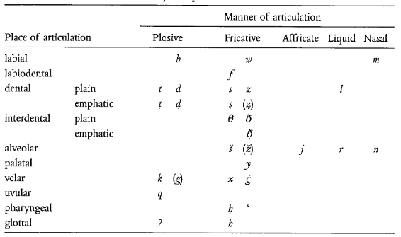
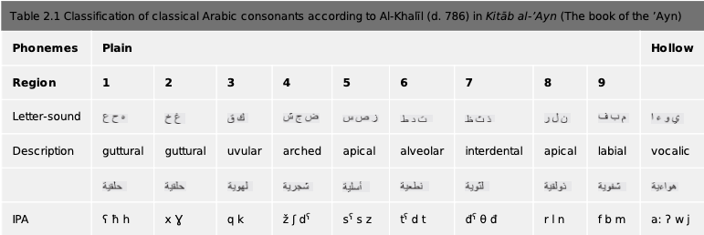

# Arabic Phonology
## The Study of Phonology
As we have seen, varieties of Arabic have historically been classified into `'Alfu.s.hA` and ``'Al`AmmIya``, the formal (or "pure") and colloquial types.  
The most common `'Alfu.s.hA` variety of today, Modern Standard Arabic, is of course not the native language of any section of the population. It therefore derives its notions of correctness in pronunciation from its predecessor, Classical Arabic, which has not been spoken for centuries. Thus for this we rely on descriptions by early Arab grammarians and philologists.  

This is problematic because, while the early studies of Arabic phonology were extremely detailed as far as phonemes are concerned, fall short in non-phonemic matters, like stress and intonation.[^1]  

[^1]: Holes, Clive. *Modern Arabic: Structures, functions, and varieties.* Georgetown University Press, 2004. (pages 56-7)

The first scholar to systematically study Arabic phonology was Al-Khalil, in his work ``kitAb 'Al`Ayn``. This was carried on by his disciple Sibawayhi, in his monumental work `'AlkitAb`. Some contributions (in particular, the details of the vowel system) were later made in Ibn Jinni's `'Al_hasA'is`.[^2]

[^2]: Benmamoun, Elabbas, and Reem Bassiouney, eds. *The Routledge handbook of Arabic linguistics.* Routledge, 2018 (page 11); Owens, Jonathan. *The Oxford handbook of Arabic linguistics.* Oxford University Press, 2013. (page 38)

## The Inventory
Modern Standard Arabic has a relatively rich consonant inventory, consisting of 28 sounds, and a restricted vowel inventory with 3 phonemes.[^3]

[^3]: Holes, Clive. *Modern Arabic: Structures, functions, and varieties.* Georgetown University Press, 2004 (page 57); Owens, Jonathan. *The Oxford handbook of Arabic linguistics.* Oxford University Press, 2013. (page 39)

Variation across dialectal phonology has persisted from the early Islamic period, evidenced by Sibawayhi's descriptions. In his `kitAb`, he lists six "good" (`musta.hsAna`) and seven "bad" (`.gayr musta.hsAna`) variations.[^4]

[^4]: Owens, Jonathan. *The Oxford handbook of Arabic linguistics.* Oxford University Press, 2013. (pages 38, 45)

### Consonants
We have noted above that there are 28 consonant phonemes in MSA. These can be seen in Figure 1 (the phonemes in brackets are dialectal variations).  

A distinctive feature of Arabic is the high percentage (8 out of 28) of "guttural" (velar and postvelar) consonants in its inventory. In addition to plain velar and postvelar consonants, there are "emphatic" variants of four front consonants (a common feature across Semitic languages), which in Arabic are realised as "pharyngealised" consonants. These sounds are characterised by three processes in articulation:

* the retraction of the tongue tip
* the raising of the back part of the tongue towards the velum
* the constriction of the pharynx caused by (2).[^5]

[^5]: Holes, Clive. *Modern Arabic: Structures, functions, and varieties.* Georgetown University Press, 2004 (page 57)

These emphatic consonants are described as *mutbaq* ("covered" or "enclosed"), as opposed to *munfatih* ("open").[^6]  

[^6]: Owens, Jonathan. *The Oxford handbook of Arabic linguistics.* Oxford University Press, 2013. (page 55)

The consonants were called `'usUl` or "primary" by Al-Khalil, and were classified by him into "plain" (`si.hA.h`) and "hollow" (`'a^gwaf`). The plain consonant phonemes were further grouped into articulatory areas (Figure 2).[^7]

[^7]: Owens, Jonathan. *The Oxford handbook of Arabic linguistics.* Oxford University Press, 2013. (page 38)

These consonants form the inventory of both MSA and CLA, with the following three points of difference:

* `.d`, which in MSA is an emphatic voiced dental stop, but which Sibawayhi describes as having no non-emphatic counterpart;
* `.t`, which in MSA is an emphatic unvoiced dental stop, but which Sibawayhi describes as the emphatic version of /d/;
* `q`, which in MSA is an unvoiced uvular stop, but which Sibawayhi describes as voiced.[^8]

[^8]: Benmamoun, Elabbas, and Reem Bassiouney, eds. *The Routledge handbook of Arabic linguistics.* Routledge, 2018 (pages 12-3)

### Vowels
Arabic's vowel system is considerably reduced, consisting of only three phonemes: /i/, /u/ and /a/.  
In addition, there is a length-based distinction, *i.e.*, /i:/, /u:/ and /a:/ are distinct from the above three.[^10]

[^10]: Owens, Jonathan. *The Oxford handbook of Arabic linguistics.* Oxford University Press, 2013. (page 38)

The qualities of the three vowels are:

* /i/ is a close front vowel, pronounced with lips spread
* /u/ is a close back vowel, pronounced with lips rounded
* /a/ is an open vowel.

However, their realisation often depends on the dialect and the context.[^9]

[^9]: Holes, Clive. *Modern Arabic: Structures, functions, and varieties.* Georgetown University Press, 2004 (page 60)

## Syllable Structure
There are mainly six types of syllables: `Cv`, `Cv:`, `CvC`, `Cv:C`, `CvCC` and `Cv:CC`. Note that the onset can only consist of a single consonant.[^11]

[^11]: Holes, Clive. *Modern Arabic: Structures, functions, and varieties.* Georgetown University Press, 2004 (page 61)

## Processes
There are a number of phonological processes (synchronic) that occur; some are restricted to a limited number of dialects, while the others are present across all.  

One example of a process not present in all dialects is affrication, which is a feature of Gulf Arabic. In the presence of front vowels, velar stops (/g/ and /k/) change into the corresponding alveolar affricates (/dz/ and /ts/).[^12]

[^12]: Benmamoun, Elabbas, and Reem Bassiouney, eds. *The Routledge handbook of Arabic linguistics.* Routledge, 2018 (page 22)

Another example of a (more widespread) phonological process is pharyngealisation. As we have seen above, some consonants have emphatic or pharyngealised versions; these sounds cause their surroundings to be pronounced with a more retracted tongue root. This process occurs in Levantine, Gulf and Yemeni Arabic.  
However, there are differences in the way the `[+RTR]` feature spreads. For example, the number of segments, the direction of spreading and the segments which can block the spreading are some conditions which vary across dialects.[^13]

[^13]: Benmamoun, Elabbas, and Reem Bassiouney, eds. *The Routledge handbook of Arabic linguistics.* Routledge, 2018 (page 24)

An important process that occurs across all dialects of Arabic is the assimilation of the definite article /l-/. When the noun starts with a coronal consonant, the /l/ of the definite article assimilates to this. Examples of this include *n-noor* ("the light"), *sh-shams* ("the sun"), etc.  
However, an exception to this is the affricate /dz/. It is hypothesised that this is because /dz/ is the reflex of Proto-Semitic /g/, which is not a coronal phoneme.[^14]

[^14]: Benmamoun, Elabbas, and Reem Bassiouney, eds. *The Routledge handbook of Arabic linguistics.* Routledge, 2018 (page 25)

## Levantine Arabic
There are numerous features distinguishing Levantine phonology from that of MSA. We will consider three well-known ones: the reflexes of the interdental fricatives (`_t`, `_d` and `.z`), the voiced alveolo-palatal affricate `^g`, and the voiceless uvular stop `q`.

### Interdental Fricatives
This is a feature shared by the Levantine (except Jordanian), Hejazi, Egyptian and Maghrebi dialects of Arabic. The three interdental fricatives (voiceless and voiced plain, and voiced pharyngealised) are pronounced as the corresponding dental stops. This, in fact, is perceived as a characteristic of sedentary dialects across the Arab world, and is not shared by the bedouin varietes, even in the Levant.  

It is possible that this sound change is due to the Aramaic substrate present in this region, although this is not considered likely by some.[^15]  

[^15]: Holes, Clive, ed. *Arabic historical dialectology: Linguistic and sociolinguistic approaches.* Vol. 30. Oxford University Press, 2018. (page 876)

Notably, Levantine and Egyptian Arabic replace these sounds with the corresponding alveolar fricatives, in *borrowings* from MSA.[^16]  

[^16]: Benmamoun, Elabbas, and Reem Bassiouney, eds. *The Routledge handbook of Arabic linguistics.* Routledge, 2018 (page 14)

An interesting sociological distinction among the three pronunciations surfaces when we consider the relative prestiges of the three sets of pronunciations:  
The bedouin dialects preserve the interdental fricatives of MSA, and this pronunciation is popularly accepted as the most "correct" one.  
The native urban pronunciation popular in the Levant is the dental stops listed above, which are perceived as the most informal.  
The interdental fricatives used by urban speakers in loans and neologisms lie somewhere in between.  

Nevertheless, recently settled bedouins often switch from the interdentals to the alveolars in conversation with urban speakers. Moreover, which pronunciation is to be used is often decided by the semantic and pragmatic content of the word, where some words are associated with a certain pronunciation and would not be changed regardless of the formality.[^17]

[^17]: Holes, Clive. *Modern Arabic: Structures, functions, and varieties.* Georgetown University Press, 2004. (page 72-3)

### Alveolar Affricate
The alveolar affricate `^g` also has a number of reflexes across the Arab world.

In the Levant, a distinction is drawn between the dialects of rural and bedouin-origin populations, and other varieties (including Levantine MSA). The former pronounces this phoneme with its reflex in "common" MSA (the affricate), while the latter as a fricate /z/.[^18]

[^18]: Holes, Clive. *Modern Arabic: Structures, functions, and varieties.* Georgetown University Press, 2004 (page 75); Benmamoun, Elabbas, and Reem Bassiouney, eds. *The Routledge handbook of Arabic linguistics.* Routledge, 2018. (page 15)

### Uvular Stop
The voiceless uvular stop `q` is another phoneme which varies widely across dialects of Arabic. In the Levant itself, there are four distinct ways it is realised.  

In urban varieties, it usually surfaces as either /q/ itself, or the glottal stop. In rural and bedouin dialects, /q/ and /g/ are preferred pronunciations.  
In Palestine's rural regions, however, its reflexes also include /k/ and /ts/. Jordanian dialects also realise it as /g/.[^19]  

[^19]: Holes, Clive. *Modern Arabic: Structures, functions, and varieties.* Georgetown University Press, 2004 (page 73); Benmamoun, Elabbas, and Reem Bassiouney, eds. *The Routledge handbook of Arabic linguistics.* Routledge, 2018. (page 15)

Here, too, we can note some sociolinguistic phenomena. It has been claimed that the /g/ realisation of this phoneme has become associated with "masculinity", and the glottal realisation with "femininity", causing men of all backgrounds to adopt the former and women of all backgrounds to adopt the latter.  
In addition, the /k/ and /ts/ pronunciations have, it appears, become stigmatised as "rural" and are fading in the speech of younger speakers.[^20]

[^20]: Holes, Clive. *Modern Arabic: Structures, functions, and varieties.* Georgetown University Press, 2004 (page 73)