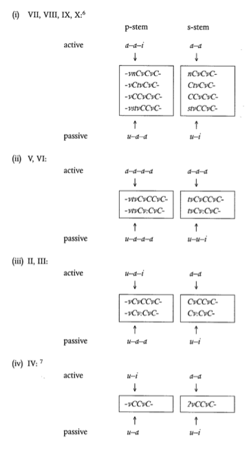
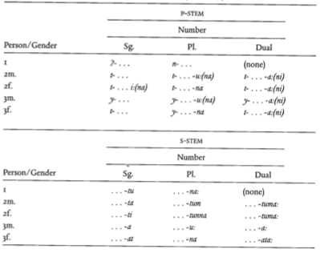

# Morphology
## Overview
The general principle of Arabic morphology is in line with that of the rest of the Semitic languages. This holds for all forms of Arabic – Classical, Modern Standard, and the dialects.  

The morphology is *nonconcatenative* – it does not rest on discontinuous segments (roots and affixes), but rather on a root-and-pattern system. Here, a word is made up of a root, which consists of (usually) three consonants, and a pattern, which inserts other sounds between the consonants of the root (called radicals).  

For example, `KTB` is a root meaning "write". Applying various patterns on it gives us words like `kitAb` (book), `maktab` (desk), `'iktitAb` (subscription).  
There are some constraints on the co-occurrence of radicals in roots (for example, the first two consonants cannot be homorganic).  

There are two types of patterns that are layered on the root to create actual words. First, derivational modifications are carried out (morphosemantic patterns), followed by inflections (morphosyntactic patterns).  

It is important to note that roots are *semantic abstractions*, *i.e.*, they are not functional words but only "hints" to the meaning of the words they form. The application of morphosemantic patterns yields what are known as *augmented roots*, which are also semantic abstractions; morphosyntactic patterns finally create actual words.[^1]

[^1]: Holes, Clive. *Modern Arabic: Structures, functions, and varieties.* Georgetown University Press, 2004. (page 99)

## Verb
## Morphosemantic Patterns
There are ten morphosemantic patterns that can be applied to a root to generate different forms of verbs. A rough overview of their forms and functions follows (we will denote the consonants of the root as `X`, `Y`, `Z` respectively).  
However, a single verb will usually not show more than eight different patterns.

* Pattern I (`XYZ`): This is the basis of derivational morphology and the most common pattern. It usually forms words by inserting short vowels `XaYaZ` (actions performed by agents, transitive or intransitive), `XaYiZ` (actions performed on oneself, *agent moyen*) or `XaYuZ` (acquisition of permanent qualities).
* Pattern II (`XYYZ`): This pattern has three main uses – it may intensify the meaning of Pattern I, indicate that the action was performed by another agent, or denote ascription of a quality to another entity.
* Pattern III (`Xv:YZ`): This pattern denotes an effort to achieve the meaning of Pattern I.
* Pattern IV (`?XYZ`): This pattern generally has a causative or factitive sense. It may overlap with Pattern III.
* Pattern V (`tXYZ`): This pattern denotes a reflexive action, or the effect of an action. It is common for verbs to have Pattern I (stative), Pattern II (causative) and Pattern V (reflexive) forms.
* Pattern VI (`tXv:YZ`): This pattern usually expresses a reciprocal action.
* Pattern VII (`nXYZ`): This pattern denotes the passive of Pattern I. It may have a similar sense to Pattern V.
* Pattern VIII (`XtYZ`): This pattern also has a reflexive sense, like Pattern V.
* Pattern IX (`XYZZ`): This pattern applies to a closed class of inchoative verbs. These verbs refer only to colours and physical defects.
* Pattern X (`stXYZ`): This pattern indicates the reflexive of Pattern IV.

There exist a small number of quadriliteral roots as well (roots with four consonants). Some of these are derived by fairly regular processes from triliteral roots, while the others are derived from foreign borrowings.[^2]

[^2]: Holes, Clive. *Modern Arabic: Structures, functions, and varieties.* Georgetown University Press, 2004. (page 100)

### Morphosyntactic Patterns
The augmented stem (after the application of a morphosemantic pattern) can generate two different stems for the finite verb, depending roughly on the aspect (the state of completion of the verb).  

One stem, which inflects further with both prefixes and suffixes, is called the imperfect stem or the p-stem. The other main stem that can be formed inflects with only suffixes, and is called the perfect stem or the s-stem.  

Each of these two stems has its own set of patterns for active and passive, and for each combination of person (first, second or third), number (singular, dual or plural), and gender (masculine or feminine).

Figure 1 shows the formation of the active and passive roots for both the p- and s-stems. Figure 2 shows the inflection of these roots according to person, number and gender.[^3]

[^3]: Holes, Clive. *Modern Arabic: Structures, functions, and varieties.* Georgetown University Press, 2004. (page 106)

### Levantine Arabic
There are two main types of changes that occurred in the eastern dialects of Arabic (including the urban centres of the Levant, as well as Cairo) – the loss of syntactic categories and modifications to the morphosemantic system.  

Of the first type, we note that in the 2nd and third person plural, the gender distinction is lost; the masculine form is generalised to both. The dual number is also lost, and superseded by the plural.  
Furthermore, the passive is consistently formed by a prefix (`'it-`), reminiscent of Patterns V and VI in MSA.  

Of the second type, we note that the vowels used in forming words of Pattern I are always the same for a certain stem (`a-a`, `i-i` or `u-u`).  
The initial `t-` of Patterns V and VI has in fact become identical to the `'it-` prefix. Similarly, Patterns II and IV (causatives and factitives) have partially coalesced together.[^4]

[^4]: Holes, Clive. *Modern Arabic: Structures, functions, and varieties.* Georgetown University Press, 2004. (page 119)

## Noun
There are mainly two types of nouns in Arabic – "primitive" nouns, which are not derived from any verbal root, and derivatives of verbs.  

Primitive nouns cannot function as adjectives, and are mostly masculine (some are feminine). Derived nouns, on the other hand, can sometimes function as adjectives (specifically, those denoting states, comparatives, diminutives and relational adjectives).
Derived nouns are of nine types – instance nouns, nouns of manner, nouns of place and time, nouns of instrument, nouns of profession/occupation, nouns of states, comparatives, diminutives and abstract nouns.[^5]

[^5]: Holes, Clive. *Modern Arabic: Structures, functions, and varieties.* Georgetown University Press, 2004. (page 155)

### Number
In MSA (and CLA), nouns distinguish three numbers: singular, dual and plural (for more than two objects). Collective nouns form a separate category and have their own patterns.  

Plurals are formed in two ways – suffixation and interdigitation of vowels.  
The nouns of profession or occupation, relational adjectives, comparatives, and a few primitive nouns form their plurals with suffixes – specifically, `-Una` (nominative) and `-Ina` (accusative and genitive) for masculine, and `-Atun` (nominative) and `-Itun` (accusative and genitive) for feminine.  

Plurals formed by interdigitation are often named *broken plurals*. These are unpredictable for primitive nouns, but fixed for derivatives; each pattern has a corresponding plural pattern.  

Notably, a single noun may have more than one plural. In such cases, it is possible for each plural to have a different sense.  

In the dialects (including Levantine), the rules for forming plurals are largely the same. The dual number is lost.  
There are also fewer broken plurals in the dialects.[^6]

[^6]: Holes, Clive. *Modern Arabic: Structures, functions, and varieties.* Georgetown University Press, 2004. (page 162)

### Case and Definiteness
Arabic has a three-case system, distinguishing nominative, accusative and genitive.  

There are two kinds of nouns – *triptotes* and *diptotes*. Triptotes distinguish definite from indefinite nouns in all three cases; indefiniteness is marked with a terminal *-n* (a process called *nunation* after the name of the letter representing /n/, *nun*).  

Interestingly, the `-N` also functions as an adverbial marker. Many of these words have been loaned into Hindi-Urdu and are in common use; *e.g.*, `masalana` (from `ma_talaN`, "for example"), `fOrana` (from `fawraN`, "immediately"), and `qarIbana` (from `qarIbaN`, "nearly").  

Diptotic nouns, on the other hand, collapse the accusative and genitive cases, and do not mark indefiniteness.  

In the dialects, however, case has disappeared from casual speech (a manifestation of the deletion of final short vowels, which is a consistent phonological rule operating between MSA and the dialects).[^7]

[^7]: Holes, Clive. *Modern Arabic: Structures, functions, and varieties.* Georgetown University Press, 2004. (page 172)