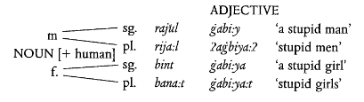
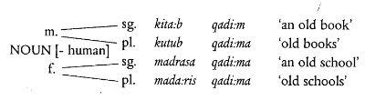

**Language:** North Levantine Arabic

# Syntax
## Overview
Modern Standard Arabic, and, to a lesser extent, the Arabic dialects, tend to the synthetic side of the typological spectrum. Thus, features marked by syntax in English come under the domain of morphology in Arabic (for example, causatives, passives, etc.). Thus, the syntax is not as rich as the morphology.  

We will first have a broad description of sentence structure (including word order), and then a finer look at the internal structures of constituents (noun and verb phrases).

## Sentence Structure
Word order in Arabic has canonically been considered free by grammarians, due to the rich verbal morphology and the declension system in place for nouns. However, in practice, it is considerably more rigid, nearly determined by a number of syntactic, semantic and discourse factors.[^1] We will consider a small number of these here.  

[^1]: Holes, Clive. *Modern Arabic: Structures, functions, and varieties.* Georgetown University Press, 2004. (page 250)

A sentence in Arabic can be analysed as consisting of a subject and a predicate. The predicate may or may not contain a *finite* verb (it may have only a noun, or some form of participle); if there is no finite verb, the subject must be *freestanding* (it cannot be expressed as an enclitic suffix on the verb).  

The most frequent word order is VSO, followed by SVO. However, the length of a constituent (the number of words it includes, sometimes also called its *heaviness*) also plays a factor in its positioning – it is preferred to place heavier constituents towards the end.[^2]  

[^2]: Holes, Clive. *Modern Arabic: Structures, functions, and varieties.* Georgetown University Press, 2004. (page 251)

The definiteness of the subject is the first factor in determining the word order in the dialects; an indefinite subject comes after the verb (VSO). If the subject is definite, if the verb does not refer to an event (as opposed to a state) *and* the object is freestanding, then the word order is SVO.[^3]  

[^3]: Holes, Clive. *Modern Arabic: Structures, functions, and varieties.* Georgetown University Press, 2004. (page 259)

In the matter of *agreement* between the subject and the verb, there is a divergence between MSA and the dialects.  
In MSA, the verb always agrees with the subject in gender, but not in number *if it occurs before the subject*. Contrast this with the dialects (including Levantine), in which both gender and number always agree.[^4]

[^4]: Holes, Clive. *Modern Arabic: Structures, functions, and varieties.* Georgetown University Press, 2004. (page 262)

## Phrase Structure
We will look at the structures of noun phrases and verb phrases here.

### Noun Phrases
Broadly, an Arabic noun phrase can be one of three types – a simple noun, a noun-adjective pair, and a *construct phrase*.

#### Noun-Adjective Pairs
A noun-adjective phrase is composed of a noun and an attributive adjective. The two elements agree in gender, number, case and definiteness (see below).  

Definiteness is straightforward; the adjective needs to be made definite by prefixing *(?a)l-*. Case, too, inflects in a relatively simple manner.  

Gender and number, however, interact in more intricate ways. In the case of human nouns and nonhuman singular nouns, the gender and number both agree; in the case of nonhuman plural nouns, the adjective is invariably in its feminine singular form.[^5]

[^5]: Holes, Clive. *Modern Arabic: Structures, functions, and varieties.* Georgetown University Press, 2004. (page 202)

Definiteness is a characteristic of nouns and noun phrases. In general, a noun is definite if it is preceded by the definite article *(?a)l-*, it is followed by a pronominal suffix, it is the first element in a construct phrase (see below), *or* it is a proper noun.[^6]

[^6]: Holes, Clive. *Modern Arabic: Structures, functions, and varieties.* Georgetown University Press, 2004. (page 196)

#### Construct Phrases
Construct phrases (formed by a process called *?idaafa*, or *annexation*) consist of two nouns, the second (the "amplifying" noun) modifying the first (the "annexing" noun) in some way. In such phrases, the annexing noun must be indefinite, and the amplifying noun must be in the genitive case.  

Attributive adjectives modifying construct phrases occur after *both* the elements (even though, semantically, they may only modify the annexing noun).  

Semantically, these phrases can have a wide variety of meanings. The relation between the nouns may be one of identity (*the city of Damascus*), quantity (*a cup of coffee*), agency (*the arrival of the king*), and so on.[^7]  

[^7]: Holes, Clive. *Modern Arabic: Structures, functions, and varieties.* Georgetown University Press, 2004. (page 205) 

In the dialects, construct phrases are often formed not by simple juxtaposition and inflection (as in MSA), but by the insertion of a particle between the constituent nouns. This process may, however, be restricted to a subset of the senses inherent in general *?idaafa*.  
For example, in Amman, Jordan, the particle *taba'* carries the meaning of possession.[^8]

[^8]: Holes, Clive. *Modern Arabic: Structures, functions, and varieties.* Georgetown University Press, 2004. (page 208)

#### Numbers in Noun Phrases
The agreement in numbers is significantly different between MSA and the dialects, and thus deserves a mention.  

MSA requires the number modifying the noun to agree with it in gender and number. All numbers except multiples of 10 (starting from 20) have distinct masculine and feminine forms.  

In the dialects, however, the numbers from 3 to 10, despite preserving both forms, utilise them to create a *semantic* distinction. The feminine forms are used for counting and for naming the numerals, while the masculine forms are used for actual enumeration.  
The numbers from 11 to 19 also have two forms corresponding to this distinction. However, they were formed not as reflexes of the gender forms in CLA/MSA, but as contractions of the base forms.[^9]

[^9]: Holes, Clive. *Modern Arabic: Structures, functions, and varieties.* Georgetown University Press, 2004. (page 215)

### Verb Phrase
The verb phrase in Arabic is a complex entity, in the matter of the correspondence between its internal structure and its semantics. The added dimension of *al-fusha* vs. *al-ammiyah* varieties increases this complexity.  
A complete exposition of the verbal system is out of the scope of this paper. However, a few broad statements can be made.  

The MSA verb, as we have seen, inflects in two stems – the p-stem and the s-stem. Historically, this distinction corresponds to an aspectual inflection; s-stems indicated that the action was completed, while p-stems indicated that it was ongoing.  
Mood is marked by further inflection on these stems in MSA.  

In the dialects, however, the p-/s-stem distinction has begun to move towards a marker of tense rather than aspect. Furthermore, the mood is usually marked by proclitic particles, prefixed to the verb.[^10]

[^10]: Holes, Clive. *Modern Arabic: Structures, functions, and varieties.* Georgetown University Press, 2004. (page 217)

This is a manifestation of the general tendency of the dialects to be more analytical than *al-fusha* varieties.

## References
1. Holes, Clive. *Modern Arabic: Structures, functions, and varieties.* Georgetown University Press, 2004
