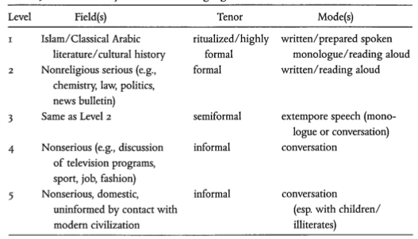

# Writing System
The Arabic script is written from right to left, and always in cursive (*i.e.*, all the letters are joined). Each letter has four slightly different forms depending on whether it occurs in an initial, a medial or a final position, or independently.  

Short vowels are *not* marked in text, except in the Qur'an and in pedagogical material. Long vowels (other than /a:/) are written with letters that double as consonants (/u:/ with `w`, and /i:/ with `y`).[^1]  

[^1]: Holes, Clive. *Modern Arabic: Structures, functions, and varieties.* Georgetown University Press, 2004. (page 391)

These features classify the Arabic script as an *abjad*.

# Diglossia
The first outline of the concept of diglossia, laid out by Ferguson, cited Arabic as a prototype of the phenomenon. He distinguished the H and L varieties of Arabic (what we have been calling `'Alfu.s.hA` and ``'Al`AmmIya``), and a third, "semiformal", variety as well.  

However, these clear, binary distinctions are vague at best (and indefensible at worst). The variation between extremely formal and extremely informal Arabic, if it can be pictured discretely, is much more nuanced and fine-grained than this simplistic model.  
El-Said Badawi described five levels of language use in Cairo, although these distinctions hold across the Arab world. The various levels in Badawi's model are:

* `fu.s.hA AlturA_t` (or "heritage `fu.s.hA`")
* `fu.s.hA Al'asr` (or "`fu.s.hA` of the [present] age")
* `'AmmIyat Almu_taqqafIn` (or "`AmmIyaT` of the [well-]educated")
* `'AmmIyat almutanawwirIn` (or "`AmmIyaT` of the literate")
* `'AmmIyat al'ummIyIn` (or "`AmmIyaT` of the illiterate")

Levels 1 and 2 are *qualitatively* different from levels 3, 4 and 5, in terms of their morphosyntax. The former group is based on prescriptive `fu.s.hA`, while the latter (no matter how heavily they are influenced by `fu.s.hA` vocabulary and phonology) retain numerous, clearly "dialectal", features (like word order, expression of mood and aspect, and so on).  
These two groups can be considered a more granular view of Ferguson's bird's-eye H/L distinction. Functionally, the usage of the various levels, described in Halliday's framework of subject matter ("field"), the relationship among the participants ("tenor") and the manner of expression ("mode"), can be found in Figure 1.[^2]

[^2]: Holes, Clive. *Modern Arabic: Structures, functions, and varieties.* Georgetown University Press, 2004. (page 341)

# Universals
A list of relevant universals (a subset of which are considered below) can be found in the appendix.

## Phonology
Some relevant phonological universals borne out by Levantine Arabic are:

* It distinguishes between vowels and consonants.
* It has fewer vowels (approximately six) than consonants (approximately 30).
* It does not have less than three vowels (given the length distinction).
* It has one front high (/i/), one back high (/u/) and one low (/a/) vowel.
* It distinguishes high and low, and front and back vowels.
* There are no two phonemes differing only in that one is bilabial and one is labiodental.

* It has open syllables.
* It has syllables with and without initial consonants.

## Morphology
The morphology, as we have seen, varies to a large extent through the spectrum of levels described above. Broadly, however, one can say that `'Alfu.s.hA` varieties are more synthetic, while Levantine Arabic (like any other ``'Al`AmmIya`` variety) is more analytic.  

It is also important to note that as Arabic (all varieties) has a non-concatenative morphology, it is obviously impossible to distinguish morpheme boundaries in many cases. Further, a single inflection may carry several features (like the person-number-gender inflections of MSA). Thus Arabic may also be described as having a fusional morphology.  

This is seen in the preference for the use of particles (free morphemes) over morphological strategies (for example, in `'i.dAfaT`). In addition, the erosion of the case system for nouns in the dialects, and the more symmetric, less redundant verbal inflection system, bear this out.  

Some relevant universals are:

* MSA and Levantine Arabic have both inflection and derivation.
* MSA has a plural as well as a dual.
* Both MSA and Levantine Arabic have the categories of gender as well as number.
* They have pronominal categories with three persons and at least two numbers.

## Syntax
Some important syntactic universals, evidenced by Arabic's syntactic system are as follows:

* The subject precedes the object in the normal order (VSO in MSA, SVO in Levantine)
* The language has prepositions, and the genitive follows the governing noun (cf. `'i.dAfaT`)
* MSA is VSO, and prepositional.
* SVO is the most frequent word order apart from VSO (in MSA).

* Question particles are found in an initial position in Levantine Arabic, and it is prepositional.
* The dominant order is VSO and the adjective comes after the noun (in MSA).