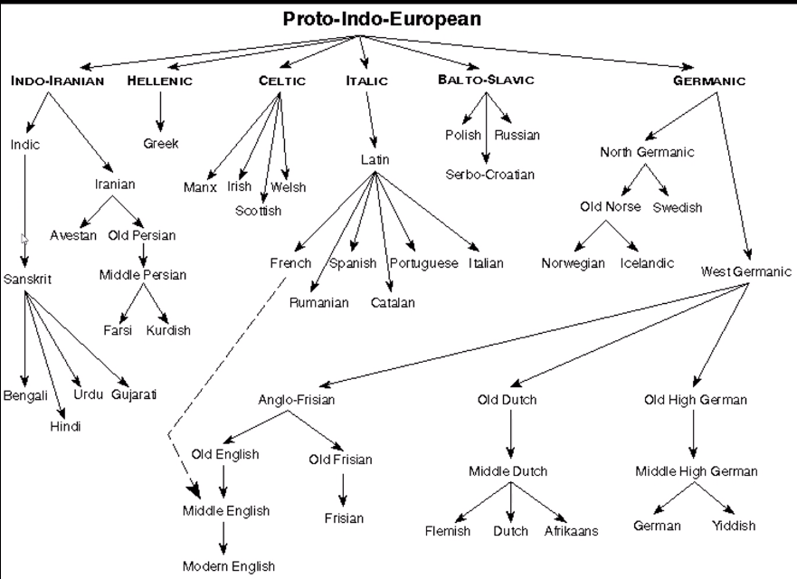
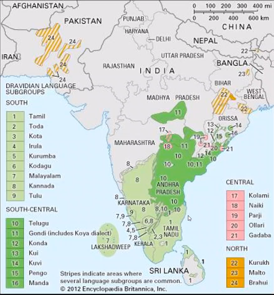

# Introduction
Languages can be grouped into families according to their origin. For example, the Indo-European language family includes all the following languages.

Similarly, we have the Dravidian language family, whose languages spread over most of South India. Notably, Brahui is a Dravidian language spoken in Balochistan, and Kurukh and Malto are Dravidian languages spoken in Chhattisgarh.  

Languages are also influenced by contact, however. For example, the Indo-Aryan languages spoken in North India have more similarities with Dravidian languages (like SOV word order) than with, say, English; Brahui is extremely different from Malayalam or Kannada.  
Thus languages that are closely related may diverge, while unrelated languages can become more similar.
